# 検証結果：isaacsim.core.experimental の API バックエンド（usd / usdrt / fabric / tensor）

実施日：2026-11-02〜03
対象：Isaac Sim 6.2.0（`6.2.0-rc.14`）の `isaacsim.core.experimental.prims` 1.12.1 / `isaacsim.core.experimental.utils` 0.23.3 / `isaacsim.core.simulation_manager` 1.17.4、omni.physx 110.4.4、usdrt.scenegraph 7.6.3。GPU は RTX 3060 (12 GB)

検証コード：[code/](code/)　生データ：[results/](results/)（`*.json` が結果、`*.log` が実行ログ。ファイル名の接尾辞が構成を表す：なし＝既定、`__physx_fabric`、`__gpu`、`__no_fsd`）

## 0. 前提と用語

| 用語              | この文書での意味                                                                                                                                                                    |
| --------------- | --------------------------------------------------------------------------------------------------------------------------------------------------------------------------- |
| USD             | `pxr` で読み書きする本来のシーン記述。属性値はレイヤー（Sdf）に保存され、ファイルに保存できる                                                                                                                         |
| Fabric          | USD の値を描画・物理向けに平たく並べ直した実行時のデータ置き場。`usdrt` パッケージから読み書きする。ファイルには残らない                                                                                                          |
| FSD             | Fabric Scene Delegate。**描画が USD ではなく Fabric を見る方式。 <br>**6.2.0 の標準アプリ（[isaacsim.exp.base.kit:207](../../apps/isaacsim.exp.base.kit#L207)）で有効。`usdrt` / `fabric` バックエンドの前提条件 |
| PhysX           | 物理エンジン本体（omni.physx）。Play 中だけ剛体などのオブジェクトを持つ                                                                                                                                 |
| tensor          | `omni.physics.tensors` の View（RigidBodyView など）。<br>**PhysX 内部の値を配列でまとめて読み書きする窓口。**<br>**Play 中（Pause 中も含む）だけ有効**                                                           |
| update          | Kit のメインループ 1 回（`app.update()`）。Play 中なら物理が 1 ステップ（1/60 s）進む。Pause 中は進まない                                                                                                   |
| resetOnStop     | Stop 時に物理状態を Play 前に戻す設定。標準アプリで true（[isaacsim.exp.base.kit:274](../../apps/isaacsim.exp.base.kit#L274)）                                                                    |
| change tracking | Play 中に Fabric の変更を PhysX に取り込む仕組み（`IPhysxSimulation.pause_change_tracking` で止められる）                                                                                         |

測定した構成：

| 構成名          | 内容                                                                                                                                                                                                                                                                                      | 対応する起動方法                                                                                               |
| ------------ | --------------------------------------------------------------------------------------------------------------------------------------------------------------------------------------------------------------------------------------------------------------------------------------- | ------------------------------------------------------------------------------------------------------ |
| 既定           | FSD 有効、omni.physx.fabric 無効、CPU 物理。<br>PhysX は計算結果を USD に書く（`/physics/updateToUsd = true`）                                                                                                                                                                                              | `isaac-sim.bat`（isaacsim.exp.base 系）                                                                   |
| physx_fabric | 上に加えて omni.physx.fabric を有効化（`SimulationManager.enable_fabric(True)`）。<br>**PhysX は計算結果を Fabric に書き、USD には書かない**                                                                                                                                                                        | `isaac-sim.fabric.bat`（[isaacsim.exp.full.fabric.kit:15](../../apps/isaacsim.exp.full.fabric.kit#L15)） |
| GPU          | `SimulationManager.set_device("cuda:0")`。<br>GPU dynamics + GPU broadphase、<br>omni.physx.fabric 有効、<br>`/physics/suppressReadback = true`（[simulation_manager.py:1048](../../exts/isaacsim.core.simulation_manager/isaacsim/core/simulation_manager/impl/simulation_manager.py#L1048)） | 上記アプリで GPU を選んだとき。Isaac Lab などの GPU 並列学習の構成                                                            |
| FSD 無効       | `--/app/useFabricSceneDelegate=false` で起動（S01 のみ）                                                                                                                                                                                                                                       | 旧来の OmniHydra 構成                                                                                       |
|              |                                                                                                                                                                                                                                                                                         |                                                                                                        |

物理の検証は描画なしの軽量 kit（[code/bp_verify.kit](code/bp_verify.kit)）、描画と同期の検証（R01・S01）は描画ありの標準 python kit（headless）で行った。各層の値は、検証対象のラッパーを通さず下位 API で直接読んだ（[code/bplib.py](code/bplib.py) の `snapshot()`。Fabric は CPU 側に加え、描画が見る GPU 側も `fabric_device_state()` で読んだ）。GPU 構成では `get_rigidbody_transformation`（表の PhysX 列）は GPU の状態を返さないので、PhysX の値は tensor で読んだ値を正とする。

## 1. 結論

| 質問                                          | 答え                                                                                                                                                                                                                                                                                                                                                                                                           | 根拠  |
| ------------------------------------------- | ------------------------------------------------------------------------------------------------------------------------------------------------------------------------------------------------------------------------------------------------------------------------------------------------------------------------------------------------------------------------------------------------------------ | --- |
| どんなパイプラインか                                  | **USD が「正本」、Fabric は USD の写しで描画はこれを映す、PhysX は Play 開始時に USD から作られる。Fabric → USD の流れはどこにも無い。** ラッパーの「バックエンド」は、この 4 層（USD / Fabric / PhysX＋tensor）のどれを直接読み書きするかを選ぶスイッチにすぎない。**Play 中に USD / Fabric の変更が PhysX に入るのは CPU 物理のときだけ**で、GPU 構成では tensor 以外の経路はほぼ閉じる                                                                                                                                                 | §2  |
| 名前空間でバックエンドを類推できるか                          | **Isaac 側の名前空間（`isaacsim.core.experimental.prims.RigidPrim`）からは分からない。** 同じ `set_world_poses` でも、クラス・タイムライン状態・`use_backend` の指定で行き先が変わり、返り値の型も全部 `warp.array`。Articulation では同じメソッドが tensor なら root リンク、usd なら Articulation の Xform と**別のものを動かす**。**分かるのは「実際に呼ばれた下位ライブラリ」の名前空間**（`pxr.*`＝USD、`usdrt.*`＝Fabric、`warp.fabricarray`＝Fabric 一括、`omni.physics.tensors.*`＝tensor）。"backend" という語自体も 3 つの別の意味で使われている | §3  |
| Play ON/OFF で書き換え系メソッドを呼ぶとどうなるか／反転すると何が起きるか | **Stop 中は tensor が使えないので、ほぼ全部 USD に書かれ、Stop 後も残る。** **Play 中は既定で tensor（PhysX）に書かれ、Stop で消える。** Play 中に usd で書いた値が Stop 後に残るかは、値の種類と構成で変わる（既定構成は位置・速度が巻き戻り質量は残る、physx_fabric / GPU 構成は全部残る）。**Pause 中も tensor は使える**が、PhysX の結果が USD / Fabric に出るのは再開してから                                                                                                                                                    | §4  |

### 特に注意すべき挙動（実測）

1. **フォールバックは原則として黙って起きる。** RigidPrim の既定バックエンドは `tensor` だが、Stop 中は警告なしで `usd` に切り替わる。警告が出るのは `use_backend` で明示したときだけ（N-03, N-05）。検出したいなら `use_backend("tensor", raise_on_fallback=True)`。
2. **未対応のバックエンドを指定すると「候補リストの先頭」に落ちる。** `set_velocities` に `usdrt` を指定すると tensor に、Stop 中ならさらに usd に二段で落ちる（N-03）。
3. **`fabric` を指定した `set_world_poses` は `usdrt` に読み替えられる**（[xform_prim.py:597](../../exts/isaacsim.core.experimental.prims/isaacsim/core/experimental/prims/impl/xform_prim.py#L597)）。
4. **Fabric に書いた値は簡単に消える。** Stop 中、同じ prim に未処理の API スキーマ適用があると次の update で USD の値に作り直される。`RigidPrim(...)` のコンストラクタ自体がスキーマを適用するので、作った直後の usdrt / fabric 書き込みは 1 update で消える（P-08）。
5. **GPU 構成では、Play 中に USD や Fabric に書いた位置・速度・関節目標は PhysX に届かない**（質量は届く）。条件は「GPU シーン」と「`suppressReadback = true`」の両方。片方だけなら届く（G01）。Play 中の操作は tensor でしか効かない。
6. **GPU 構成で Pause 中に update を 1 回でも回して再開すると、PhysX の結果が Fabric に出なくなり、描画が止まる。** 物理は進み続ける。Stop → Play で直る（Q-92, R-07）。GUI の Pause は描画のために update を回し続けるので、この条件に当たる。
7. **描画は USD ではなく Fabric を映す（1〜2 フレーム遅れ）。** physx_fabric / GPU 構成で Play 中に usd で位置を書いて Stop すると、USD（保存される値）と描画（Fabric）が食い違ったまま残る（R-06、R-08）。
8. **physx_fabric 構成で、Play 前に無かった `physics:velocity` を Play 中に USD で作ると、効くのは 1 ステップだけで、次の Play 開始時も 0 として読まれる。** 属性を Play 前から作っておけば起きない（U01、§4.5）。
9. **GPU 構成で、Play 中に usd で変形体（DeformablePrim）の姿勢を書くと simulation view 全体が無効になり、同じシーンの RigidPrim も黙って USD の古い値を返すようになる**（D-90）。
10. **FSD 有効時、USD に書いた値は `SynchronizeToFabric()` か次の update まで Fabric に反映されない。** ラッパーの `usdrt` / `fabric` バックエンドは同期を呼ばないので、USD に書いた直後に読むと古い値を返す（S01）。
11. **`use_backend("simstate")` はこのインストールでは何もしない**（必要なパッケージ `isaacsim.mega.sim_state` が無く、エラーログが出るだけで例外にならない）（A-91）。

## 2. 質問 1：パイプライン

### 2.1 構成ごと・データの種類ごとの流れ（図）

1 つの図には 1 つの構成・1 つのデータの種類だけを描いた。時間は上から下へ流れ、灰色の帯がタイムラインの段階（Stop 中 → Play 開始 → Play 中 → Stop）。矢印は「値がそこへ届く」こと、矢印のラベルは「いつ届くか」。届かない経路は矢印を描かず、注記に書いた。

共通の前提（全構成・全データで同じ）：

- 描画は Fabric を映す。Fabric の変更は 1〜2 フレーム遅れて画面に出る（§2.6）。
- Fabric → USD の流れはどこにも無い（P-02、P-07）。
- `RigidPrim` の既定バックエンドは、Play 中は tensor、Stop 中は usd（警告なしで切り替わる）。

#### 既定構成（CPU 物理、omni.physx.fabric 無効）

##### 位置（既定構成）

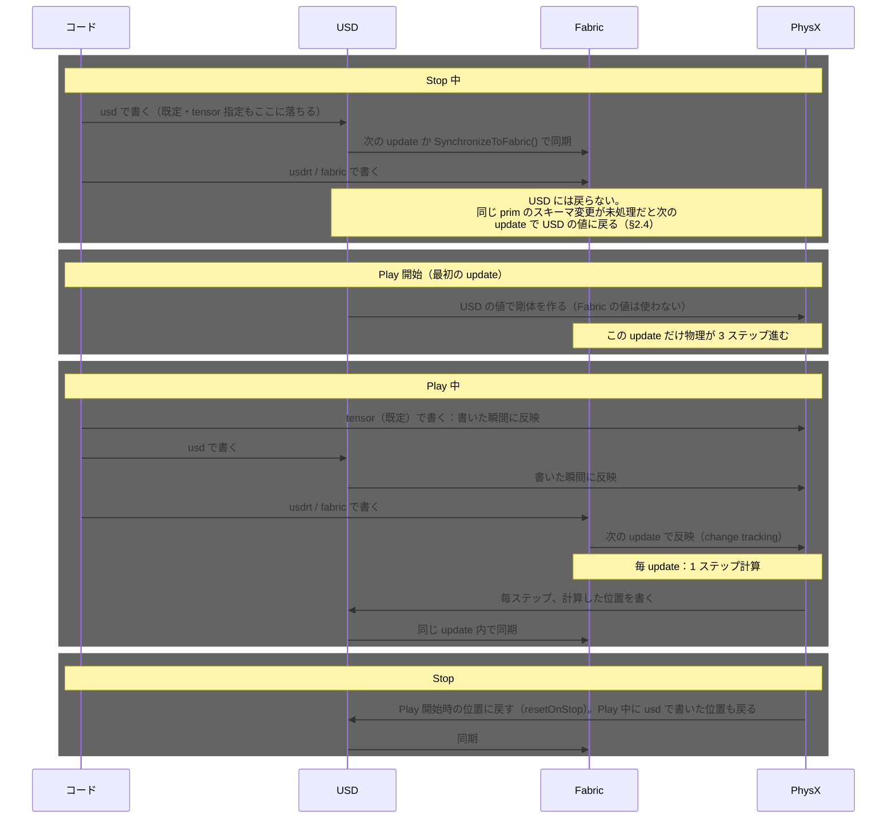
```mermaid
sequenceDiagram
    participant C as コード
    participant U as USD
    participant F as Fabric
    participant P as PhysX
    rect rgb(100, 100, 100)
    Note over C,P: Stop 中
    C->>U: usd で書く（既定・tensor 指定もここに落ちる）
    U->>F: 次の update か SynchronizeToFabric() で同期
    C->>F: usdrt / fabric で書く
    Note over U,P: USD には戻らない。<br/>同じ prim のスキーマ変更が未処理だと次の<br/>update で USD の値に戻る（§2.4）
    end
    rect rgb(100, 100, 100)
    Note over C,P: Play 開始（最初の update）
    U->>P: USD の値で剛体を作る（Fabric の値は使わない）
    Note over F,P: この update だけ物理が 3 ステップ進む
    end
    rect rgb(100, 100, 100)
    Note over C,P: Play 中
    C->>P: tensor（既定）で書く：書いた瞬間に反映
    C->>U: usd で書く
    U->>P: 書いた瞬間に反映
    C->>F: usdrt / fabric で書く
    F->>P: 次の update で反映（change tracking）
    Note over F,P: 毎 update：1 ステップ計算
    P->>U: 毎ステップ、計算した位置を書く
    U->>F: 同じ update 内で同期
    end
    rect rgb(100, 100, 100)
    Note over C,P: Stop
    P->>U: Play 開始時の位置に戻す（resetOnStop）。Play 中に usd で書いた位置も戻る
    U->>F: 同期
    end
```

##### 速度（既定構成）

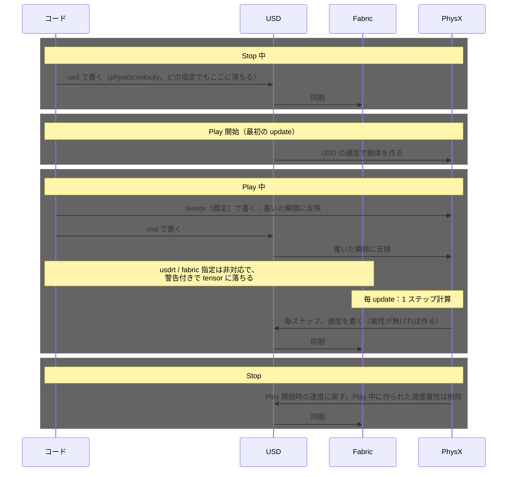
```mermaid
sequenceDiagram
    participant C as コード
    participant U as USD
    participant F as Fabric
    participant P as PhysX
    rect rgb(100, 100, 100)
    Note over C,P: Stop 中
    C->>U: usd で書く（physics:velocity。どの指定でもここに落ちる）
    U->>F: 同期
    end
    rect rgb(100, 100, 100)
    Note over C,P: Play 開始（最初の update）
    U->>P: USD の速度で剛体を作る
    end
    rect rgb(100, 100, 100)
    Note over C,P: Play 中
    C->>P: tensor（既定）で書く：書いた瞬間に反映
    C->>U: usd で書く
    U->>P: 書いた瞬間に反映
    Note over C,F: usdrt / fabric 指定は非対応で、<br/>警告付きで tensor に落ちる
    Note over F,P: 毎 update：1 ステップ計算
    P->>U: 毎ステップ、速度を書く（属性が無ければ作る）
    U->>F: 同期
    end
    rect rgb(100, 100, 100)
    Note over C,P: Stop
    P->>U: Play 開始時の速度に戻す。Play 中に作られた速度属性は削除
    U->>F: 同期
    end
```

##### 質量（既定構成）

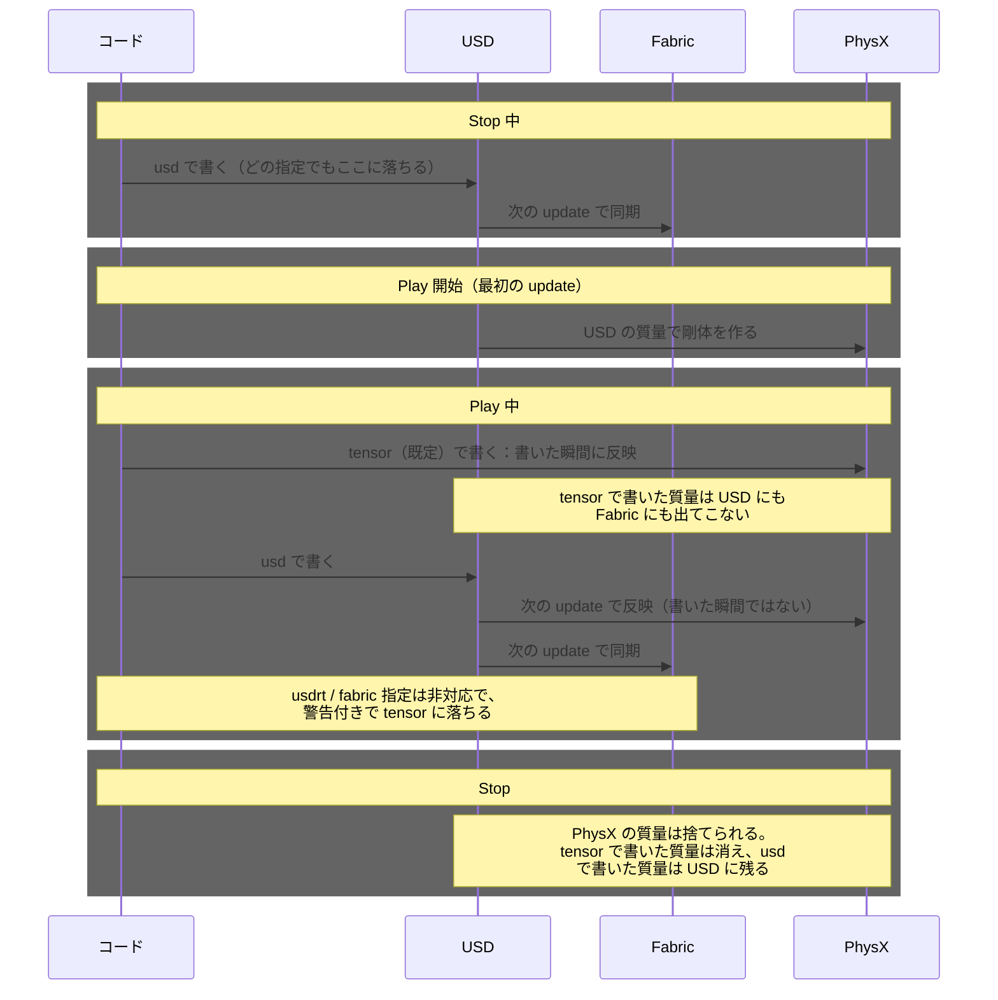
```mermaid
sequenceDiagram
    participant C as コード
    participant U as USD
    participant F as Fabric
    participant P as PhysX
    rect rgb(100, 100, 100)
    Note over C,P: Stop 中
    C->>U: usd で書く（どの指定でもここに落ちる）
    U->>F: 次の update で同期
    end
    rect rgb(100, 100, 100)
    Note over C,P: Play 開始（最初の update）
    U->>P: USD の質量で剛体を作る
    end
    rect rgb(100, 100, 100)
    Note over C,P: Play 中
    C->>P: tensor（既定）で書く：書いた瞬間に反映
    Note over U,P: tensor で書いた質量は USD にも<br/>Fabric にも出てこない
    C->>U: usd で書く
    U->>P: 次の update で反映（書いた瞬間ではない）
    U->>F: 次の update で同期
    Note over C,F: usdrt / fabric 指定は非対応で、<br/>警告付きで tensor に落ちる
    end
    rect rgb(100, 100, 100)
    Note over C,P: Stop
    Note over U,P: PhysX の質量は捨てられる。<br/>tensor で書いた質量は消え、usd<br/>で書いた質量は USD に残る
    end
```

##### 関節：目標角と関節角（既定構成、Articulation）

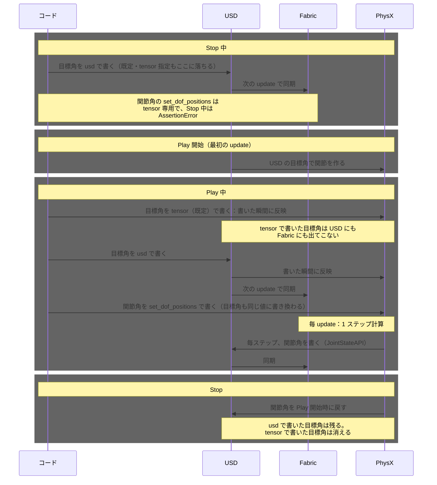
```mermaid
sequenceDiagram
    participant C as コード
    participant U as USD
    participant F as Fabric
    participant P as PhysX
    rect rgb(100, 100, 100)
    Note over C,P: Stop 中
    C->>U: 目標角を usd で書く（既定・tensor 指定もここに落ちる）
    U->>F: 次の update で同期
    Note over C,F: 関節角の set_dof_positions は<br/>tensor 専用で、Stop 中は<br/>AssertionError
    end
    rect rgb(100, 100, 100)
    Note over C,P: Play 開始（最初の update）
    U->>P: USD の目標角で関節を作る
    end
    rect rgb(100, 100, 100)
    Note over C,P: Play 中
    C->>P: 目標角を tensor（既定）で書く：書いた瞬間に反映
    Note over U,P: tensor で書いた目標角は USD にも<br/>Fabric にも出てこない
    C->>U: 目標角を usd で書く
    U->>P: 書いた瞬間に反映
    U->>F: 次の update で同期
    C->>P: 関節角を set_dof_positions で書く（目標角も同じ値に書き換わる）
    Note over F,P: 毎 update：1 ステップ計算
    P->>U: 毎ステップ、関節角を書く（JointStateAPI）
    U->>F: 同期
    end
    rect rgb(100, 100, 100)
    Note over C,P: Stop
    P->>U: 関節角を Play 開始時に戻す
    Note over U,P: usd で書いた目標角は残る。<br/>tensor で書いた目標角は消える
    end
```

#### physx_fabric 構成（CPU 物理、omni.physx.fabric 有効）

##### 位置（physx_fabric 構成）

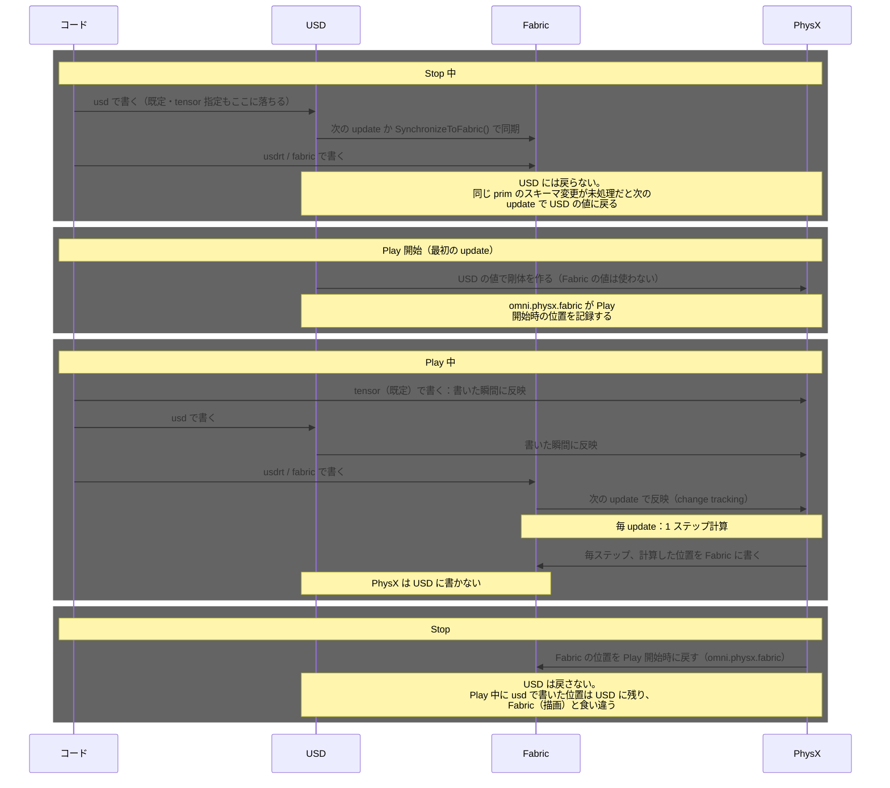
```mermaid
sequenceDiagram
    participant C as コード
    participant U as USD
    participant F as Fabric
    participant P as PhysX
    rect rgb(100, 100, 100)
    Note over C,P: Stop 中
    C->>U: usd で書く（既定・tensor 指定もここに落ちる）
    U->>F: 次の update か SynchronizeToFabric() で同期
    C->>F: usdrt / fabric で書く
    Note over U,P: USD には戻らない。<br/>同じ prim のスキーマ変更が未処理だと次の<br/>update で USD の値に戻る
    end
    rect rgb(100, 100, 100)
    Note over C,P: Play 開始（最初の update）
    U->>P: USD の値で剛体を作る（Fabric の値は使わない）
    Note over U,P: omni.physx.fabric が Play<br/>開始時の位置を記録する
    end
    rect rgb(100, 100, 100)
    Note over C,P: Play 中
    C->>P: tensor（既定）で書く：書いた瞬間に反映
    C->>U: usd で書く
    U->>P: 書いた瞬間に反映
    C->>F: usdrt / fabric で書く
    F->>P: 次の update で反映（change tracking）
    Note over F,P: 毎 update：1 ステップ計算
    P->>F: 毎ステップ、計算した位置を Fabric に書く
    Note over U,F: PhysX は USD に書かない
    end
    rect rgb(100, 100, 100)
    Note over C,P: Stop
    P->>F: Fabric の位置を Play 開始時に戻す（omni.physx.fabric）
    Note over U,P: USD は戻さない。<br/>Play 中に usd で書いた位置は USD に残り、<br/>Fabric（描画）と食い違う
    end
```

##### 速度（physx_fabric 構成）

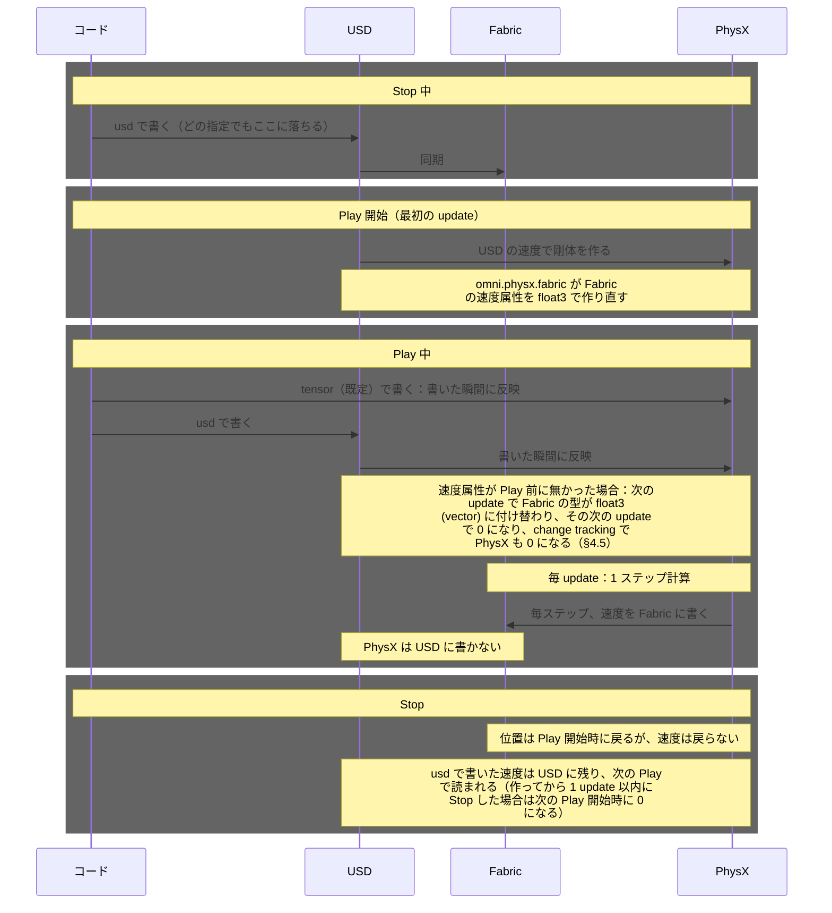
```mermaid
sequenceDiagram
    participant C as コード
    participant U as USD
    participant F as Fabric
    participant P as PhysX
    rect rgb(100, 100, 100)
    Note over C,P: Stop 中
    C->>U: usd で書く（どの指定でもここに落ちる）
    U->>F: 同期
    end
    rect rgb(100, 100, 100)
    Note over C,P: Play 開始（最初の update）
    U->>P: USD の速度で剛体を作る
    Note over U,P: omni.physx.fabric が Fabric<br/>の速度属性を float3 で作り直す
    end
    rect rgb(100, 100, 100)
    Note over C,P: Play 中
    C->>P: tensor（既定）で書く：書いた瞬間に反映
    C->>U: usd で書く
    U->>P: 書いた瞬間に反映
    Note over U,P: 速度属性が Play 前に無かった場合：次の<br/>update で Fabric の型が float3<br/>(vector) に付け替わり、その次の update<br/>で 0 になり、change tracking で<br/>PhysX も 0 になる（§4.5）
    Note over F,P: 毎 update：1 ステップ計算
    P->>F: 毎ステップ、速度を Fabric に書く
    Note over U,F: PhysX は USD に書かない
    end
    rect rgb(100, 100, 100)
    Note over C,P: Stop
    Note over F,P: 位置は Play 開始時に戻るが、速度は戻らない
    Note over U,P: usd で書いた速度は USD に残り、次の Play<br/>で読まれる（作ってから 1 update 以内に<br/>Stop した場合は次の Play 開始時に 0<br/>になる）
    end
```

##### 質量（physx_fabric 構成）

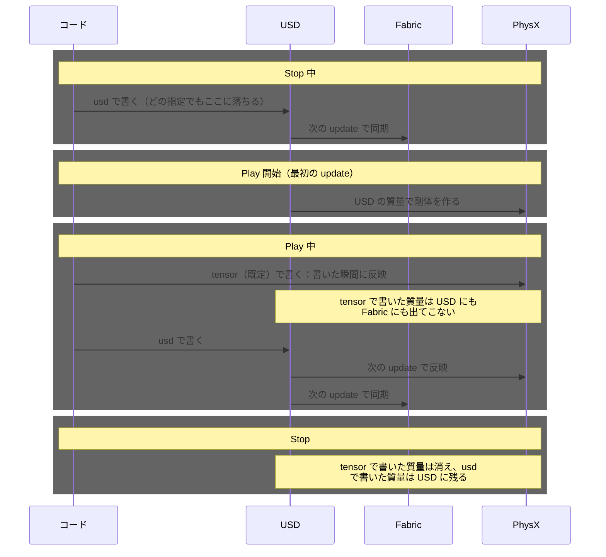
```mermaid
sequenceDiagram
    participant C as コード
    participant U as USD
    participant F as Fabric
    participant P as PhysX
    rect rgb(100, 100, 100)
    Note over C,P: Stop 中
    C->>U: usd で書く（どの指定でもここに落ちる）
    U->>F: 次の update で同期
    end
    rect rgb(100, 100, 100)
    Note over C,P: Play 開始（最初の update）
    U->>P: USD の質量で剛体を作る
    end
    rect rgb(100, 100, 100)
    Note over C,P: Play 中
    C->>P: tensor（既定）で書く：書いた瞬間に反映
    Note over U,P: tensor で書いた質量は USD にも<br/>Fabric にも出てこない
    C->>U: usd で書く
    U->>P: 次の update で反映
    U->>F: 次の update で同期
    end
    rect rgb(100, 100, 100)
    Note over C,P: Stop
    Note over U,P: tensor で書いた質量は消え、usd<br/>で書いた質量は USD に残る
    end
```

##### 関節：目標角と関節角（physx_fabric 構成、Articulation）

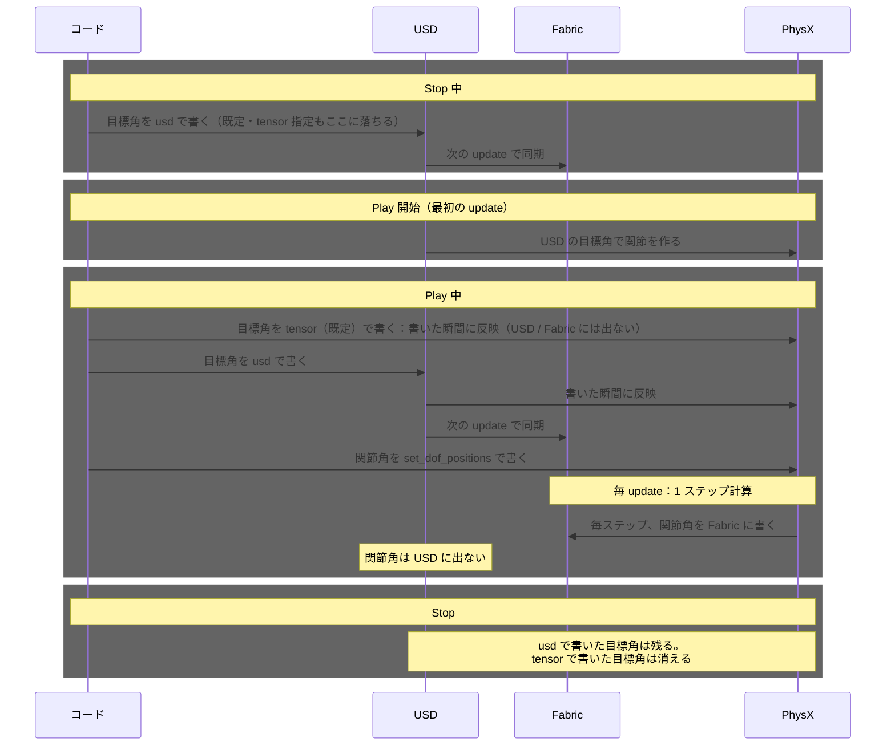
```mermaid
sequenceDiagram
    participant C as コード
    participant U as USD
    participant F as Fabric
    participant P as PhysX
    rect rgb(100, 100, 100)
    Note over C,P: Stop 中
    C->>U: 目標角を usd で書く（既定・tensor 指定もここに落ちる）
    U->>F: 次の update で同期
    end
    rect rgb(100, 100, 100)
    Note over C,P: Play 開始（最初の update）
    U->>P: USD の目標角で関節を作る
    end
    rect rgb(100, 100, 100)
    Note over C,P: Play 中
    C->>P: 目標角を tensor（既定）で書く：書いた瞬間に反映（USD / Fabric には出ない）
    C->>U: 目標角を usd で書く
    U->>P: 書いた瞬間に反映
    U->>F: 次の update で同期
    C->>P: 関節角を set_dof_positions で書く
    Note over F,P: 毎 update：1 ステップ計算
    P->>F: 毎ステップ、関節角を Fabric に書く
    Note over U: 関節角は USD に出ない
    end
    rect rgb(100, 100, 100)
    Note over C,P: Stop
    Note over U,P: usd で書いた目標角は残る。<br/>tensor で書いた目標角は消える
    end
```

#### GPU 構成（GPU 物理、omni.physx.fabric 有効、readback 抑止）

##### 位置（GPU 構成）

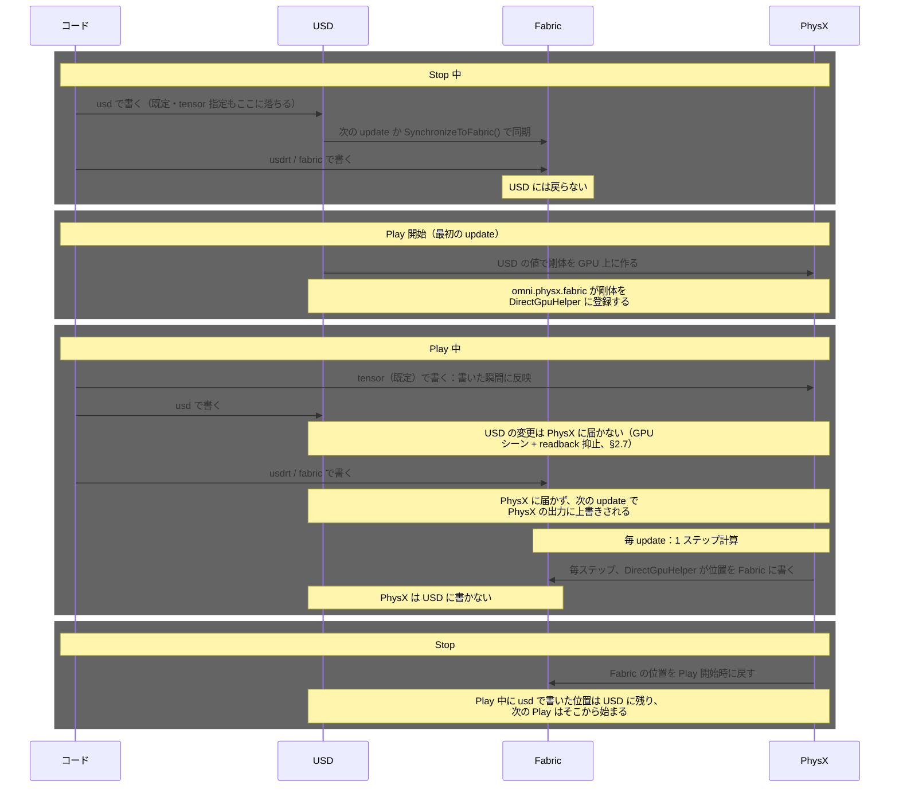
```mermaid
sequenceDiagram
    participant C as コード
    participant U as USD
    participant F as Fabric
    participant P as PhysX
    rect rgb(100, 100, 100)
    Note over C,P: Stop 中
    C->>U: usd で書く（既定・tensor 指定もここに落ちる）
    U->>F: 次の update か SynchronizeToFabric() で同期
    C->>F: usdrt / fabric で書く
    Note over F: USD には戻らない
    end
    rect rgb(100, 100, 100)
    Note over C,P: Play 開始（最初の update）
    U->>P: USD の値で剛体を GPU 上に作る
    Note over U,P: omni.physx.fabric が剛体を<br/>DirectGpuHelper に登録する
    end
    rect rgb(100, 100, 100)
    Note over C,P: Play 中
    C->>P: tensor（既定）で書く：書いた瞬間に反映
    C->>U: usd で書く
    Note over U,P: USD の変更は PhysX に届かない（GPU<br/>シーン + readback 抑止、§2.7）
    C->>F: usdrt / fabric で書く
    Note over U,P: PhysX に届かず、次の update で<br/>PhysX の出力に上書きされる
    Note over F,P: 毎 update：1 ステップ計算
    P->>F: 毎ステップ、DirectGpuHelper が位置を Fabric に書く
    Note over U,F: PhysX は USD に書かない
    end
    rect rgb(100, 100, 100)
    Note over C,P: Stop
    P->>F: Fabric の位置を Play 開始時に戻す
    Note over U,P: Play 中に usd で書いた位置は USD に残り、<br/>次の Play はそこから始まる
    end
```

##### 位置：Pause を挟んだとき（GPU 構成）

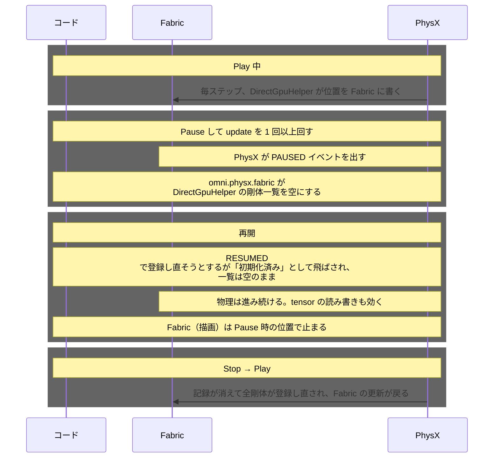
```mermaid
sequenceDiagram
    participant C as コード
    participant F as Fabric
    participant P as PhysX
    rect rgb(100, 100, 100)
    Note over C,P: Play 中
    P->>F: 毎ステップ、DirectGpuHelper が位置を Fabric に書く
    end
    rect rgb(100, 100, 100)
    Note over C,P: Pause して update を 1 回以上回す
    Note over F,P: PhysX が PAUSED イベントを出す
    Note over C,P: omni.physx.fabric が<br/>DirectGpuHelper の剛体一覧を空にする
    end
    rect rgb(100, 100, 100)
    Note over C,P: 再開
    Note over C,P: RESUMED<br/>で登録し直そうとするが「初期化済み」として飛ばされ、<br/>一覧は空のまま
    Note over F,P: 物理は進み続ける。tensor の読み書きも効く
    Note over C,P: Fabric（描画）は Pause 時の位置で止まる
    end
    rect rgb(100, 100, 100)
    Note over C,P: Stop → Play
    P->>F: 記録が消えて全剛体が登録し直され、Fabric の更新が戻る
    end
```

##### 速度（GPU 構成）

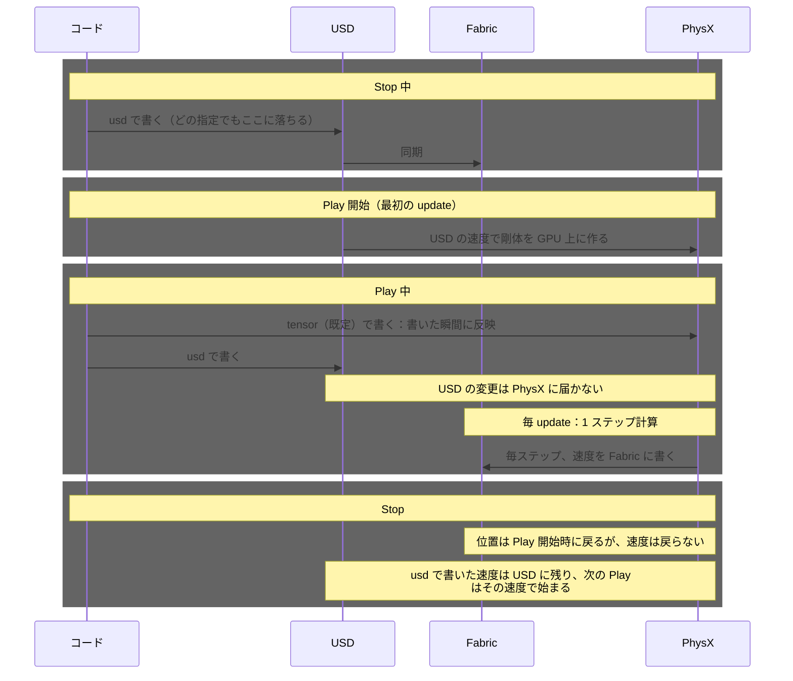
```mermaid
sequenceDiagram
    participant C as コード
    participant U as USD
    participant F as Fabric
    participant P as PhysX
    rect rgb(100, 100, 100)
    Note over C,P: Stop 中
    C->>U: usd で書く（どの指定でもここに落ちる）
    U->>F: 同期
    end
    rect rgb(100, 100, 100)
    Note over C,P: Play 開始（最初の update）
    U->>P: USD の速度で剛体を GPU 上に作る
    end
    rect rgb(100, 100, 100)
    Note over C,P: Play 中
    C->>P: tensor（既定）で書く：書いた瞬間に反映
    C->>U: usd で書く
    Note over U,P: USD の変更は PhysX に届かない
    Note over F,P: 毎 update：1 ステップ計算
    P->>F: 毎ステップ、速度を Fabric に書く
    end
    rect rgb(100, 100, 100)
    Note over C,P: Stop
    Note over F,P: 位置は Play 開始時に戻るが、速度は戻らない
    Note over U,P: usd で書いた速度は USD に残り、次の Play<br/>はその速度で始まる
    end
```

##### 質量（GPU 構成）

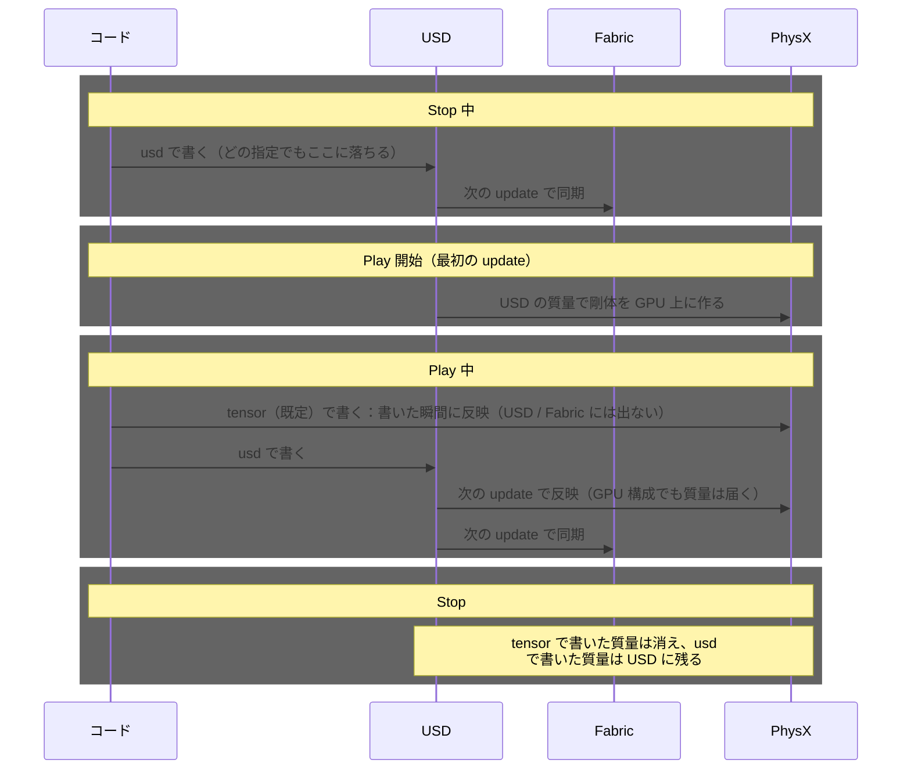
```mermaid
sequenceDiagram
    participant C as コード
    participant U as USD
    participant F as Fabric
    participant P as PhysX
    rect rgb(100, 100, 100)
    Note over C,P: Stop 中
    C->>U: usd で書く（どの指定でもここに落ちる）
    U->>F: 次の update で同期
    end
    rect rgb(100, 100, 100)
    Note over C,P: Play 開始（最初の update）
    U->>P: USD の質量で剛体を GPU 上に作る
    end
    rect rgb(100, 100, 100)
    Note over C,P: Play 中
    C->>P: tensor（既定）で書く：書いた瞬間に反映（USD / Fabric には出ない）
    C->>U: usd で書く
    U->>P: 次の update で反映（GPU 構成でも質量は届く）
    U->>F: 次の update で同期
    end
    rect rgb(100, 100, 100)
    Note over C,P: Stop
    Note over U,P: tensor で書いた質量は消え、usd<br/>で書いた質量は USD に残る
    end
```

##### 関節：目標角と関節角（GPU 構成、Articulation）

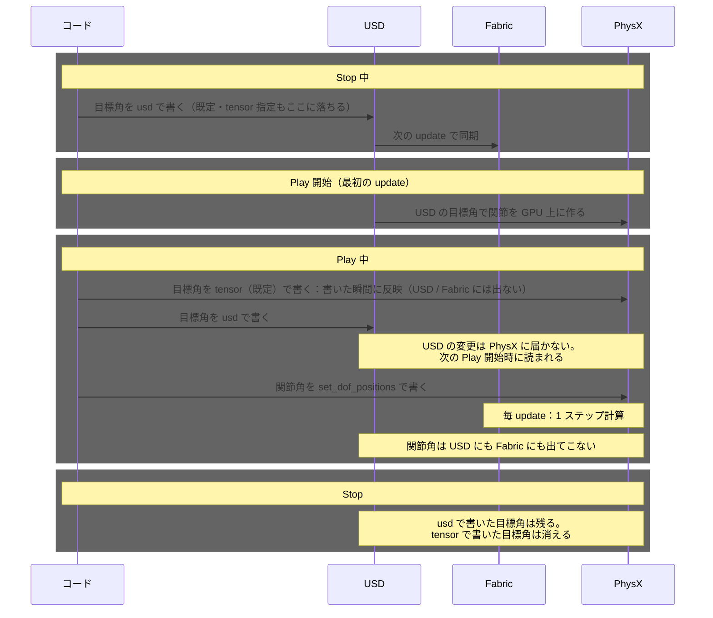
```mermaid
sequenceDiagram
    participant C as コード
    participant U as USD
    participant F as Fabric
    participant P as PhysX
    rect rgb(100, 100, 100)
    Note over C,P: Stop 中
    C->>U: 目標角を usd で書く（既定・tensor 指定もここに落ちる）
    U->>F: 次の update で同期
    end
    rect rgb(100, 100, 100)
    Note over C,P: Play 開始（最初の update）
    U->>P: USD の目標角で関節を GPU 上に作る
    end
    rect rgb(100, 100, 100)
    Note over C,P: Play 中
    C->>P: 目標角を tensor（既定）で書く：書いた瞬間に反映（USD / Fabric には出ない）
    C->>U: 目標角を usd で書く
    Note over U,P: USD の変更は PhysX に届かない。<br/>次の Play 開始時に読まれる
    C->>P: 関節角を set_dof_positions で書く
    Note over F,P: 毎 update：1 ステップ計算
    Note over U,P: 関節角は USD にも Fabric にも出てこない
    end
    rect rgb(100, 100, 100)
    Note over C,P: Stop
    Note over U,P: usd で書いた目標角は残る。<br/>tensor で書いた目標角は消える
    end
```

### 2.2 経路ごとの実測

| 経路 | 既定 | physx_fabric | GPU | 根拠 |
| --- | --- | --- | --- | --- |
| USD → Fabric | `SynchronizeToFabric()` か次の update で届く（§2.5） | 同左 | 同左。ただし Play 中は PhysX の出力が毎ステップ上書きする | S01, P-01 |
| Fabric → USD | 届かない | 届かない | 届かない | P-02, P-07 |
| USD → PhysX（Play 開始） | USD から読む。Fabric は読まない | 同左 | 同左 | P-03 |
| USD → PhysX（Play 中） | 位置・速度は書いた瞬間、質量は次の update | 同左 | **位置・速度・関節目標は届かない。** 質量だけ次の update | P-06, M01, G01, A01 |
| Fabric → PhysX（Play 中） | 剛体の localMatrix の変更が次の update で入る（change tracking） | 同左 | **届かない** | P-06, P-09, G01 |
| tensor ↔ PhysX | 書いた瞬間に変わる | 同左 | 同左 | P-06 |
| PhysX → USD | 毎ステップ位置・速度・関節角を書く（質量・関節目標は書かない） | 書かない | 書かない | P-04, M01, A01 |
| PhysX → Fabric | USD 経由で届く | 直接書く | 直接書く（関節角は書かない）。**Pause 中に update を回して再開すると止まる** | P-04, A01, Q-92 |
| Fabric → 描画 | 描画は Fabric（worldMatrix）を映す | 同左 | 同左 | R01 |
| Stop（resetOnStop） | PhysX が Play 中に書いた先（USD）を戻す。Play 前に無かった `physics:velocity` は削除 | Fabric の位置を戻す（速度は戻らない）。USD は触らない | physx_fabric と同じ | P-05, M01 |

補足：

- Fabric に載っている `xformOp:translate` 属性は Play 中も更新されない。Fabric 上の変換の正しい値は `omni:fabric:localMatrix` で、`xformOp:*` を読むと古い値になる（全測定の `fabric.translate_attr`）。
- Play 直後の最初の update では物理が複数ステップ進む（T01、§4.4）。

### 2.3 ラッパーの「バックエンド」は、どの下位 API を呼ぶかの選択

| `use_backend` の値 | 実際に呼ぶ下位 API（N-03 で記録） | 読み書きする層 | 処理単位 |
| --- | --- | --- | --- |
| `usd` | `pxr.UsdGeom.Xformable`、`pxr.UsdPhysics.MassAPI` など | USD | prim を 1 個ずつ Python でループ |
| `usdrt` | `usdrt.Sdf.Path`、`usdrt.hierarchy.IFabricHierarchy` | Fabric | prim を 1 個ずつ Python でループ |
| `fabric` | `usdrt.Usd.Stage.SelectPrims` → `warp.fabricarray` → warp カーネル | Fabric | 全 prim を 1 回のカーネルで一括。ただし `set_world_poses` は `usdrt` に読み替え |
| `tensor` | `omni.physics.tensors.api.RigidBodyView.get_transforms` / `set_transforms` など | PhysX | 全 prim を 1 回の呼び出しで一括 |
| `simstate` | `isaacsim.mega.sim_state.client` の SimStateStorage（Articulation の関節目標・力だけ） | 外部ストレージ | このインストールには無い（§3.6） |

`tensor` の View は Play 時に SimulationManager が作る simulation view から作られ（[simulation_manager.py:778](../../exts/isaacsim.core.simulation_manager/isaacsim/core/simulation_manager/impl/simulation_manager.py#L778)）、RigidPrim は `PHYSICS_READY` イベントで自分の View を作り（[rigid_prim.py:1923](../../exts/isaacsim.core.experimental.prims/isaacsim/core/experimental/prims/impl/rigid_prim.py#L1923)）、Stop イベントで捨てる（[rigid_prim.py:2060](../../exts/isaacsim.core.experimental.prims/isaacsim/core/experimental/prims/impl/rigid_prim.py#L2060)）。Stop 中に tensor が使えないのはこのため。Pause では捨てないので、Pause 中は tensor が使える（Q-91）。

### 2.4 Fabric 書き込みが消える条件（P-08）

Stop 中、剛体の Fabric 位置を y=8 に書き、その前に同じ prim へ USD 変更を仕込んだ結果（全構成で同じ）：

| 仕込んだ USD 変更 | 書いた直後 | 1 update 後 |
| --- | --- | --- |
| 何もしない | 8 | **8（残る）** |
| PhysxRigidBodyAPI を適用 → すぐ Fabric に書く | 8 | **0（USD の値に戻る）** |
| PhysxRigidBodyAPI を適用 → update → Fabric に書く | 8 | 8 |
| 無関係な属性を作成 → すぐ Fabric に書く | 8 | 8 |
| `RigidPrim(path)` を作成 → すぐ Fabric に書く | 8 | **0** |
| `RigidPrim(path)` を作成 → update → Fabric に書く | 8 | 8 |

API スキーマの適用（prim の構成が変わる変更）が未処理のまま次の update を迎えると、その prim の Fabric は USD から作り直される。属性値の変更ではこれは起きなかった。

### 2.5 USD → Fabric の同期のタイミング（S01）

usdrt の文書は 3 か所で言っていることが違う。[fabric_hierarchy.rst:143](../../extscache/usdrt.scenegraph-7.6.3+187cf21b.wx64.r.cp312/docs/fabricsd/fabric_hierarchy.rst#L143) は「USD の transform 変更は即座に localMatrix に反映」、[fsd_vs_omnihydra.md:96](../../extscache/usdrt.scenegraph-7.6.3+187cf21b.wx64.r.cp312/docs/fabricsd/fsd_vs_omnihydra.md#L96) は「即時同期は OmniHydra（FSD 無効）の動作で、FSD 有効時は変更をためて `SynchronizeToFabric()`（Kit では描画直前に自動）でまとめて反映」、[integration.md:155](../../extscache/usdrt.scenegraph-7.6.3+187cf21b.wx64.r.cp312/docs/fabricsd/integration.md#L155) は「`GetPrimAtPath()` / `GetAttributeAtPath()` は暗黙に同期する」。描画ありの標準構成で実測した（Stop 中、pxr で translate.x=2 を書いた後に Fabric の localMatrix を読む）。

| 書いた後にしたこと | FSD 有効 | FSD 無効 |
| --- | --- | --- |
| 何もしない | 古い値 (0) | 古い値 (0) |
| `GetPrimAtPath()` | **古い値 (0)**。文書の「暗黙に同期する」とは違う | 古い値 (0) |
| `SynchronizeToFabric()` | **新しい値 (2)** | 古い値 (0) |
| `app.update()` | **新しい値 (2)** | 古い値 (0) |

| 質量（`physics:mass` = 5 を pxr で書く） | FSD 有効 | FSD 無効 |
| --- | --- | --- |
| 書く前に取得した usdrt の属性オブジェクトで読む | 古い値 (1) | **新しい値 (5)（即時同期）** |
| `GetAttributeAtPath()` で読み直す | 新しい値 (5) | 新しい値 (5) |

結論：

- **FSD 有効（標準構成）では fsd_vs_omnihydra.md の説明どおり「遅延同期」。** 確実なのは `SynchronizeToFabric()` を呼ぶか update を回すこと。fabric_hierarchy.rst の「即座に反映」はこの構成には当てはまらない。`GetPrimAtPath()` は transform を同期しなかった（S-02、S-06）。
- **FSD 無効では通常の属性は即時に同期されるが、transform は Fabric に入らない**（localMatrix は update 後も古いまま、OmniHydra の `_worldPosition` も作られない。S-09）。文書の「OmniHydra は拡張が要求したデータだけを Fabric に置く」とも合う。FSD 無効で `use_backend("usdrt"/"fabric")` が `RuntimeError` になる（S-08、[impl/backend.py:133](../../exts/isaacsim.core.experimental.utils/isaacsim/core/experimental/utils/impl/backend.py#L133)）のは、この構成では Fabric の transform が当てにならないためと考えられる。
- ラッパーは `SynchronizeToFabric()` を一度も呼ばない（ソースに出現しない）。そのため **pxr で書いた直後に `XformPrim.get_world_poses` を `usdrt` / `fabric` で読むと古い値が返る**（S-07。`usd` なら新しい値）。

### 2.6 描画は Fabric を映す（R01）

真上から見下ろすカメラで赤い立方体を撮影し、画像の重心から位置を逆算した（誤差は原点付近で最大 0.09 m、それ以外は ±0.02 m 程度。[code/r01_render.py](code/r01_render.py)）。

| ケース | USD | Fabric | PhysX | 描画 |
| --- | --- | --- | --- | --- |
| R-02：Stop 中に Fabric の localMatrix だけ (-1, 0.5) にする | (0, 0) | (-1, 0.5) | − | **(-1.00, 0.50)** |
| R-03：Stop 中に `omni:fabric:worldMatrix` 属性だけ (0.5, -1) にする | (0, 0) | (0.5, -1) | − | **(0.50, -1.01)** |
| R-04：Play 中、物理で x 方向に動かす | 既定は追従 | 追従 | 0.1 → 0.2 → 0.3 | 追従 |
| R-06：GPU で、Play 中に usd で (-1, -0.5) に置く | (-1, -0.5) | (0, 0) | (0, 0) | **(-0.01, 0.00)** |
| R-07：GPU で、動いている物体を Pause（update 5 回）→ 再開 | − | 0.1 のまま | 0.2 → 0.3 → 0.4 | **0.08 → 0.10 → 0.09（止まる）** |

全構成で、描画は USD ではなく Fabric の値を映した。Fabric の worldMatrix 属性だけを書き換えた場合も描画は動いた（このとき IFabricHierarchy の localMatrix も同じ値に変わった）。

**描画は Fabric より 1〜2 フレーム遅れる（R-08）。** physx_fabric 構成で Play 中に usd で (-1, -0.5) に置いて Stop し、その後 1 update ごとに撮影した（3 回繰り返して 3 回とも同じ）。

| Stop 後の撮影 | USD | Fabric（撮影前） | 描画 |
| --- | --- | --- | --- |
| 1 回目 | (-1, -0.5) | (-1, -0.5)（この update で (0, 0) に戻る） | (-1.02, -0.47) |
| 2 回目 | (-1, -0.5) | (0, 0) | **(-1.02, -0.47)：1 つ前の Fabric の値** |
| 3〜8 回目 | (-1, -0.5) | (0, 0) | **(-0.09, 0.02)：Fabric に追いつく** |

USD は (-1, -0.5) のままなので、描画が追っているのは Fabric。最終的に **Stop 後の描画は (0, 0)、保存される USD は (-1, -0.5) と食い違う**。既定構成でも同じ手順で、描画は Fabric より 1〜2 回の撮影ぶん遅れた（3 回中 2 回が 2 回ぶん、1 回が 1 回ぶん。既定構成は resetOnStop で USD も (0, 0) に戻るので食い違いは残らない）。GPU 構成では usd の書き込みが PhysX にも Fabric にも入らないので、描画は最初から原点付近のまま。R-06 の単発撮影（Stop から 4 update 後）はこの遅れの境目にあたり、実行によって古い値と新しい値のどちらが写るかが変わった。

### 2.7 GPU 構成で Play 中の USD / Fabric 書き込みが届かない条件（G01）

GPU 構成は「GPU シーン」「omni.physx.fabric」「suppressReadback」の 3 つを同時に変えるので、1 つずつ切り替えた。PhysX が本当に GPU で解いているかは `IPhysxStatistics` の GPU メモリ使用量で確かめた（GPU シーンは全行 64 MB、CPU シーンは 0）。

| シーン | omni.physx.fabric | suppressReadback | USD 位置 | Fabric 位置 | USD 速度 | USD 質量 |
| --- | --- | --- | --- | --- | --- | --- |
| CPU | 無 | 無（既定構成） | 届く | 届く | 届く | 届く |
| CPU | 有 | 無（physx_fabric 構成） | 届く | 届く | 1 ステップだけ† | 届く |
| CPU | 有 | 有 | 届く | 届く | 1 ステップだけ† | 届く |
| GPU | 有 | 有（GPU 構成） | **届かない** | **届かない** | **届かない** | 届く |
| GPU | 有 | 無 | 届く | 届く | 1 ステップだけ† | 届く |
| GPU | 無 | 無 | 届く | 届く | 届く | 届く |
| GPU | 無 | 有 | **届かない** | **届かない** | **届かない** | 届く |

† 属性を Play 中に新規作成したため（§4.5）。omni.physx.fabric が有効なときだけ起きる。

**「GPU シーン」かつ「suppressReadback = true」のときだけ、Play 中の位置・速度の USD / Fabric 書き込みが PhysX に届かない。** omni.physx.fabric は関係しない。

付随して分かったこと：`SimulationManager.get_device()` はシーンの設定ではなく `suppressReadback` を見て `cuda` / `cpu` を返す（[simulation_manager.py:1069](../../exts/isaacsim.core.simulation_manager/isaacsim/core/simulation_manager/impl/simulation_manager.py#L1069)）。suppressReadback=false なら GPU シーンでも `cpu` と答える。

### 2.8 change tracking の担い手

- **omni.physx 本体**にある。omni.physx.fabric を無効にした既定構成でも Play 中の Fabric 書き込みが PhysX に届き、`IPhysxSimulation.pause_change_tracking(True)` で止まった（P-06, P-09）。
- omni.physx のプラグイン（`omni.physx.plugin.dll`）には `omni::physx::usdparser::UsdNoticeListener` が `omni::fabric::AttributeValuesChangedNotice` を受け取る型情報と、`PhysicsOmniAttributeValueCacheNoticeListenerFabric` という名前が入っている（文字列の抽出で確認）。USD の変更通知と同じリスナーが Fabric の属性変更通知も受けている。C++ のソースは同梱されていない。

## 3. 質問 2：名前空間からバックエンドを類推できるか

### 3.1 Isaac 側の名前空間からは分からない

バックエンドは次の 3 つで決まり、どれもモジュールパスには現れない（[impl/backend.py:158](../../exts/isaacsim.core.experimental.utils/isaacsim/core/experimental/utils/impl/backend.py#L158) `get_current_backend`、[rigid_prim.py:1897](../../exts/isaacsim.core.experimental.prims/isaacsim/core/experimental/prims/impl/rigid_prim.py#L1897) `_check_for_tensor_backend`）。

1. メソッドごとの候補リスト（実装の `get_current_backend([...])` の引数）。何も指定しなければ**先頭が使われる**。
2. `use_backend(...)` による指定。**スレッドローカル**（N-05：メインスレッドで `usd` を指定しても、別スレッドからは既定の `tensor` に見えた）。
3. tensor の View が有効か（Play / Pause 中か）。無効なら `usd` に落ちる。

N-01（静的解析）で、`isaacsim.core.experimental.prims` の 6 クラスの公開メソッドについて docstring の `Backends:` 表記と実装の候補リストを突き合わせた。**食い違いは 0 件**（順序も一致）なので、docstring の `Backends:` の先頭を見れば既定が分かる。

ただし、**同じメソッド名でもクラスによって既定が違う**。

| メソッド | XformPrim / GeomPrim / DeformablePrim | RigidPrim / Articulation |
| --- | --- | --- |
| `get_world_poses` / `set_world_poses` / `get_local_poses` / `set_local_poses` / `reset_to_default_state` | `usd` | `tensor` |

さらに **Articulation では、同じ `set_world_poses` がバックエンドによって別のものを動かす**（A01）。tensor は root リンク（剛体）を、usd / usdrt / fabric は `ArticulationRootAPI` を持つ Xform を動かす。root リンクが Xform の下に z=1 で置かれていると、tensor で (1,2,3) を指定すれば root リンクは (1,2,3)、usd なら Xform が (1,2,3) で root リンクは (1,2,4) になる。

Backends 表記の組み合わせ（定義元クラスで重複を除いたメソッド数）：

| Backends | メソッド数 | 例 |
| --- | --- | --- |
| tensor のみ | 48 | `apply_forces`、`get_coms`、`Articulation.set_dof_positions`、`DeformablePrim.set_nodal_positions` |
| usd のみ | 44 | `set_densities`、`GeomPrim.set_offsets` |
| tensor, usd | 33 | `set_velocities`、`set_masses`、`Articulation.set_dof_position_targets` |
| usd, tensor（表記の順が逆） | 3 | `Articulation.get_dof_indices` など。候補リストを使わない実装 |
| usd, usdrt, fabric | 8 | `XformPrim.get_world_poses` など |
| tensor, usd, usdrt, fabric | 8 | `RigidPrim.get_world_poses` など |
| 表記なし | 7 | `is_physics_tensor_entity_valid` など |

**tensor のみのメソッドは `use_backend` を参照しない。** Play 中は `use_backend("usd")` の中でも tensor で実行され、Stop 中は `AssertionError: Instance's physics tensor entity is not valid. Play the simulation/timeline to re-initialize it` になる（usd には落ちない）。RigidPrim の `apply_forces`（M-90）、Articulation の `set_dof_positions`（A01）、DeformablePrim の `set_nodal_positions` / `set_nodal_velocities`（D01）で確認した。

### 3.2 返り値の型でも分からない

Play 中に 5 通りのバックエンド指定で `RigidPrim.get_world_poses` / `get_velocities` を呼ぶと、返り値はすべて `warp._src.types.array`（device=cpu）だった（N-02）。型が変わるのは `stage_utils.get_current_stage(backend=...)` だけで、`usd` なら `pxr.Usd.Stage`、`usdrt` / `fabric` なら `usdrt.Usd._Usd.Stage`。

### 3.3 下位ライブラリの名前空間を見れば分かる（N-03）

ラッパー実装モジュールのグローバル変数（`pxr.UsdGeom`、`usdrt`、`warp`、`_fabric` など）と tensor View をスパイに差し替え、呼び出し中に触った名前空間を記録した（[bplib.py](code/bplib.py) の `spy_namespaces`）。表の記号：**U**＝`pxr.*`（USD）、**R**＝`usdrt.*`（Fabric、1 prim ずつ）、**F**＝`warp.fabricarray`（Fabric 一括）、**T**＝`omni.physics.tensors.*`（PhysX）。`†` は警告付きのフォールバック、`‡` は 2 段のフォールバック。

| メソッド | Stop：既定 | tensor | usd | usdrt | fabric | Play：既定 | tensor | usd | usdrt | fabric |
| --- | --- | --- | --- | --- | --- | --- | --- | --- | --- | --- |
| RigidPrim.get_world_poses | U | U† | U | R | R+F | T | T | U | R | R+F |
| RigidPrim.set_world_poses | U | U† | U | R | R | T | T | U | R | R |
| RigidPrim.get_local_poses | U | U† | U | R | R+F | T+U | T+U | U | R | R+F |
| RigidPrim.get/set_velocities、get/set_masses | U | U† | U | U‡ | U‡ | T | T | U | T† | T† |
| XformPrim.get_world_poses | U | U† | U | R | R+F | U | U† | U | R | R+F |
| XformPrim.set_world_poses | U | U† | U | R | R | U | U† | U | R | R |
| XformPrim.set_local_poses | U | U† | U | R | R+F | U | U† | U | R | R+F |

`‡` の中身は、`usdrt` → 未対応なので `tensor` → Stop 中なので `usd`（警告 2 件）。Play 中の `get_local_poses`（tensor）が USD にも触るのは、PhysX のワールド位置から親の変換（USD）を引いてローカル位置を出すため。

結論として、**「どの層に触ったか」は下位ライブラリの名前空間で確実に判別できるが、それはコードを読むか実行を追跡して初めて分かる**。呼び出し側のコードの見た目（`RigidPrim.set_world_poses(...)`）からは判別できない。

### 3.4 "backend" という語の 3 つの意味（N-04）

| どこで | 値 | 意味 |
| --- | --- | --- |
| `isaacsim.core.experimental.utils.backend.use_backend(backend)` | `usd` / `usdrt` / `fabric` / `tensor` / `simstate` | **データの置き場所**（本検証の対象） |
| `SimulationManager.get_backend()` | `numpy`（既定） | **配列ライブラリ**（numpy / torch / warp）。非推奨 API `isaacsim.core.prims` はこれを使う（[single_rigid_prim.py:96](../../extsDeprecated/isaacsim.core.prims/isaacsim/core/prims/impl/single_rigid_prim.py#L96)） |
| `omni.physics.tensors.create_simulation_view(frontend_name, stage_id=-1, backend='physx')` | `physx` | **物理エンジン**（physx / newton）。`frontend_name` のほうが配列ライブラリ |

### 3.5 `use_backend` の規則（N-05、S-08）

| ケース | 結果 |
| --- | --- |
| 指定なし、候補 `[tensor, usd]` | `tensor`（先頭） |
| `use_backend("usdrt")`、候補 `[tensor, usd]` | 警告「Unsupported backend: 'usdrt'. Falling back to 'tensor'」→ `tensor` |
| 同上で `raise_on_unsupported=True` | `RuntimeError: Unsupported backend: 'usdrt'. Supported backends: 'tensor', 'usd'` |
| 入れ子 `usd` → `tensor` → 抜ける → 抜ける | `usd` → `tensor` → `usd` → `tensor`（外側の指定に正しく戻る） |
| **FSD 無効で起動**して `use_backend("usdrt")` / `("fabric")` | `with` に入った時点で `RuntimeError: 'usdrt' and 'fabric' backends require Fabric Scene Delegate (FSD) to be enabled.`（S-08 で実際に FSD を切って確認。N-05 の模擬と一致） |
| Stop 中 `use_backend("tensor")` で `get_world_poses` | 警告 2 件、USD の値（0, 0, 1）を返す |
| Stop 中 `use_backend("tensor", raise_on_fallback=True)` | `RuntimeError: Physics tensor entity is not valid. Fallback set to 'usd' backend.` |
| Stop 中、指定なしで `get_world_poses` | **警告なし**で USD の値を返す |

### 3.6 `simstate` バックエンド（A-91）

`simstate` は Articulation の関節目標（位置・速度）と関節力だけが対応する特別な指定で、値を `isaacsim.mega.sim_state.client` の SimStateStorage に書く（[articulation.py:4687](../../exts/isaacsim.core.experimental.prims/isaacsim/core/experimental/prims/impl/articulation.py#L4687)）。モードは `use_backend("simstate")`（＝EXCLUSIVE：SimState にだけ書く）か、設定 `/isaacsim/articulation/simStateMode`（`mirror`：両方に書く）で決まる（[impl/backend.py:45](../../exts/isaacsim.core.experimental.utils/isaacsim/core/experimental/utils/impl/backend.py#L45)）。

| Play 中に `set_dof_position_targets(0.3 rad)` | 呼び出し中のモード | 結果 |
| --- | --- | --- |
| `use_backend("simstate")` | EXCLUSIVE | エラーログ「Failed to create SimStateStorage: No module named 'isaacsim.mega'」。**USD・Fabric・PhysX のどこにも書かれない。例外は出ない** |
| 設定 `simStateMode = "mirror"` | MIRROR | 同じエラーログ。通常どおり tensor で PhysX に書かれる |
| RigidPrim.set_masses を `use_backend("simstate")` の中で | − | 警告「Unsupported backend: 'simstate'. Falling back to 'tensor'」→ tensor |

`isaacsim.mega.sim_state` はこのインストール（exts / extscache / extsDeprecated）に存在しない。

## 4. 質問 3：Play ON / OFF で書き換え系メソッドを呼ぶと何が起きるか

手順（[code/m01_play_matrix.py](code/m01_play_matrix.py)）：重力 0、剛体を z=1 に静止（質量 1）。RigidPrim は Stop 中に作る。書く値は位置 (1, 2, 3)、並進速度 (0, 0.6, 0)、質量 5。

- Stop 開始：呼ぶ → update 1 回 → Play（update 1 回）→ update 9 回 → Stop
- Play 開始：Play（update 3 回）→ 呼ぶ → update 1 回 → Stop → 再 Play（update 1 回）→ update 9 回

### 4.1 Stop 中に書いた場合（3 構成とも同じ結果）

| メソッド × 指定 | 実際に書いた層 | 書いた直後 | 1 update 後 | Play 後 | 再 Stop 後 |
| --- | --- | --- | --- | --- | --- |
| `set_world_poses`：既定 / tensor† / usd | USD | USD だけ (1,2,3) | Fabric も (1,2,3) | PhysX も (1,2,3) で始まる | USD・Fabric とも (1,2,3) のまま |
| `set_world_poses`：usdrt / fabric | Fabric | Fabric だけ (1,2,3) | **Fabric が (0,0,1) に戻る**（§2.4） | (0,0,1) で始まる | (0,0,1) |
| `set_velocities`：全指定（usdrt / fabric は ‡） | USD | USD (0,0.6,0) | 同左 | PhysX も 0.6 で動き出し、10 update で y=0.12 | USD・Fabric とも 0.6 のまま |
| `set_masses`：全指定（usdrt / fabric は ‡） | USD | USD だけ 5 | Fabric も 5 | PhysX も 5 | 5 のまま |

† は警告付きのフォールバック、‡ は 2 段のフォールバック。

- **Stop 中は、指定に関係なくほぼ USD に書かれる。** 違うのは警告の有無だけ。例外は位置の `usdrt` / `fabric` で、Fabric にだけ書かれ、物理にも保存にも効かない。
- USD に書いた値は「Play 前の状態」になるので、Play → Stop を経ても残る。

### 4.2 Play 中に書いた場合

「直後」は呼んだ直後（update 前）。

#### 位置 `set_world_poses(positions=(1,2,3))`

| 指定 | 書いた層 | 1 update 後 | Stop 後：既定 | Stop 後：physx_fabric | Stop 後：GPU | 再 Play |
| --- | --- | --- | --- | --- | --- | --- |
| 既定 / tensor | PhysX（直後から (1,2,3)） | 既定：USD・Fabric も追従。physx_fabric / GPU：Fabric だけ追従 | 全層 (0,0,1) | 全層 (0,0,1) | 全層 (0,0,1) | (0,0,1) から |
| usd | USD。既定・physx_fabric は **PhysX にも直後に入る**。**GPU は PhysX に入らない** | Fabric も (1,2,3)（GPU は PhysX の出力で (0,0,1) に上書き） | **全層 (0,0,1) に巻き戻る** | **USD (1,2,3) のまま、Fabric (0,0,1)** | **USD (1,2,3) のまま、Fabric (0,0,1)** | 既定：(0,0,1)、physx_fabric / GPU：(1,2,3) から |
| usdrt / fabric | Fabric | 既定・physx_fabric：PhysX も (1,2,3)（change tracking）。**GPU：Fabric が (0,0,1) に戻り PhysX は動かない** | 全層 (0,0,1) | 全層 (0,0,1) | 全層 (0,0,1) | (0,0,1) から |

#### 速度 `set_velocities(linear=(0,0.6,0))`

| 指定 | 書いた層 | 1 update 後 | Stop 後：既定 | Stop 後：physx_fabric | Stop 後：GPU | 再 Play |
| --- | --- | --- | --- | --- | --- | --- |
| 既定 / tensor / usdrt† / fabric† | PhysX | 動き出す（y=0.01）。既定：USD・Fabric も 0.6。physx_fabric / GPU：Fabric だけ 0.6 | USD の速度属性は**削除**、Fabric は 0 | **Fabric の速度は 0.6 のまま**（位置は戻る） | 同左 | 速度 0 |
| usd | USD。既定・physx_fabric は PhysX にも直後に入る。**GPU は入らない** | 既定：動き続ける。**physx_fabric：1 ステップで 0 に戻る**（§4.5）。GPU：動かない | 削除・0 | **USD 0.6 のまま** | **USD 0.6 のまま** | 既定：0。**physx_fabric：0**（§4.5）。**GPU：0.6 で動き出す** |

#### 質量 `set_masses(5)`

| 指定 | 書いた層 | 1 update 後 | Stop 後（全構成） | 再 Play |
| --- | --- | --- | --- | --- |
| 既定 / tensor / usdrt† / fabric† | PhysX | PhysX だけ 5。**USD にも Fabric にも出てこない** | 1（消える） | 1 |
| usd | USD だけ 5（**PhysX はまだ 1**） | PhysX も 5、Fabric も 5（GPU でも届く） | **USD 5 のまま** | 5 |

### 4.3 Pause 中に書いた場合（Q01）

手順（[code/q01_pause.py](code/q01_pause.py)）：Play（update 3 回）→ Pause（update 1 回）→ 呼ぶ → Pause のまま update 3 回 → 再開（update 1 回）→ update 9 回 → Stop。

- **Pause 中は update を回しても時刻も物理も進まない。tensor View は有効なまま**（Q-91、全構成）。
- **既定（tensor）で書くと PhysX には直後に入るが、USD / Fabric には再開して 1 ステップ進むまで出てこない**（PhysX の出力はステップのときだけ）。
- **usd で書いた位置は既定・physx_fabric なら PhysX に直後に入り、Pause 中の update で Fabric にも同期される。** GPU では PhysX に入らない。
- **usdrt / fabric で書いた位置は、Pause 中は PhysX に入らず、再開した最初の update で入る**（既定・physx_fabric）。GPU では入らない。
- usd で書いた質量は、再開後の最初のステップで PhysX に入る（全構成）。
- physx_fabric で、Pause 中に usd で速度属性を作った場合は 1 ステップで消える現象（§4.5）は起きなかった（Play 中に作った場合だけ起きる）。
- Pause から再開せずに Stop した場合（Q-90）も、Play → Stop と同じ規則で戻る・残る。

**GPU 構成の Fabric 停止（Q-92）**：速度 0.6 で動かした剛体を Pause → 再開したときの、update ごとの y 位置。

| 条件 | PhysX（tensor） | Fabric（CPU 側） | Fabric（GPU 側。描画が見る） |
| --- | --- | --- | --- |
| 既定 / physx_fabric 構成 | 0.04, 0.05, 0.06, … | 同じ | 同じ |
| GPU：Pause 中に update を 1 回回して再開 | 0.04, 0.05, 0.06, 0.07, 0.08 | **0.03 のまま** | **0.03 のまま** |
| GPU：Pause 中に tensor で速度を書いて再開 | 0.05, 0.07, … | **0.03 のまま** | **0.03 のまま** |
| GPU：`/physics/fabricUseGPUInterop = true`（既定は false） | 進む | 0.03 のまま | 0.03 のまま |
| GPU：再開後、毎 update で `get_physx_fabric_interface().update()` を手で呼ぶ | 進む | 0.03 のまま | 0.03 のまま |
| **GPU：Pause 中に update を回さずに再開** | 進む | **追従する** | **追従する** |
| GPU：止まった後に Stop → Play | 0.01, 0.02, 0.03 | 追従に戻る | 追従に戻る |

描画でも同じことを確認した（R-07：PhysX が x=0.4 まで進んでも描画は 0.1 付近のまま）。**条件は「GPU 構成で、Pause 中に update を 1 回以上回すこと」。** 設定の切り替えや手動の update 呼び出しでは戻らず、Stop → Play で戻る。

**ソースで確かめた原因（X-A）**：GitHub から取得した omni.physx.fabric のソース（§4.5 の最後を参照）で読むと、次のとおり。

1. GPU 構成（readback 抑止）では、PhysX の結果を Fabric に書くのは `DirectGpuHelper` だけで、書き出す剛体の一覧（`mRigidBodies`）を持っている（[FabricManager.cpp:558](../_external/PhysX-110.3/omni/ovruntime/source/omni.physx.fabric/plugins/FabricManager.cpp#L558)）。剛体はこの一覧に `registerRigidBody()` で登録される。
2. PhysX が `PAUSED` イベントを出すと `FabricManager::pause()` が `mDirectGpuHelper.clear()` を呼び、**一覧を空にする**（[FabricManager.cpp:1534](../_external/PhysX-110.3/omni/ovruntime/source/omni.physx.fabric/plugins/FabricManager.cpp#L1534)、[DirectGpuHelper.cpp:635](../_external/PhysX-110.3/omni/ovruntime/source/omni.physx.fabric/plugins/DirectGpuHelper.cpp#L635)）。
3. `RESUMED` で `resume()` が剛体を登録し直そうとするが、Play 開始時の姿勢の記録 `mInitialTransformation` に載っている剛体は「初期化済み」として飛ばす（[FabricManager.cpp:975](../_external/PhysX-110.3/omni/ovruntime/source/omni.physx.fabric/plugins/FabricManager.cpp#L975)）。この記録は `stop()` でしか消えない（[FabricManager.cpp:1577](../_external/PhysX-110.3/omni/ovruntime/source/omni.physx.fabric/plugins/FabricManager.cpp#L1577)）ので、**一覧は空のままになり、Fabric に何も書かれなくなる。** Stop → Play で直るのは、`stop()` が記録を消し、次の Play で全剛体が登録し直されるため。
4. Pause 中に update を回さないと、PhysX の `PAUSED` / `RESUMED` イベント自体が出ない（下の実測）ので、一覧は消されない。CPU 構成では Fabric への書き込みに `DirectGpuHelper` を使わないので、イベントが出ても影響しない。

| X-A（PhysX のシミュレーションイベントの実測） | 届いたイベント | 再開後の PhysX / Fabric の y |
| --- | --- | --- |
| GPU：Pause 中に update 1 回 | `PAUSED` → `RESUMED` | 0.05 / **0.02（止まる）** |
| GPU：Pause 中に update なし | **なし** | 0.05 / 0.05 |
| physx_fabric：Pause 中に update 1 回 | `PAUSED` → `RESUMED` | 0.05 / 0.05 |

#### 動画で見る（V01）

GPU 構成で、赤い立方体を 0.6 m/s で動かして Pause → 再開した様子（[code/v01_video_gpu_pause.py](code/v01_video_gpu_pause.py)）。緑の丸が PhysX の実際の位置、立方体の上の黄色の四角が Fabric の位置、右の表が各層の x 座標。

- ①（0:04〜）Pause 中に update を回してから再開：PhysX は進み続けるが、描画と Fabric は Pause した位置で止まる
- ②（0:08〜）Stop → Play し直すと戻る
- ③（0:12〜）Pause 中に update を回さずに再開すると、描画は追従し続ける
- 最後のページ（0:20〜）：ソースで確かめた原因

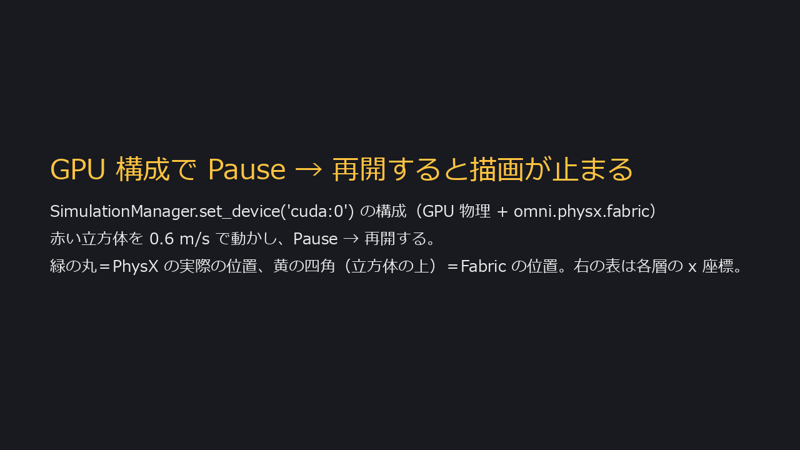

動画（MP4、H.264、27 秒）：[media/v01_gpu_pause__gpu.mp4](media/v01_gpu_pause__gpu.mp4)　要所の静止画：[止まった状態](media/v01_gpu_pause__gpu_frozen.png)、[Stop → Play で戻った状態](media/v01_gpu_pause__gpu_recovered.png)、[update を回さずに再開した状態](media/v01_gpu_pause__gpu_not_frozen.png)

### 4.4 反転したときに起きることの規則

#### Stop → Play

1. SimulationManager が PhysX を USD から作り直し、simulation view を作る（[simulation_manager.py:640](../../exts/isaacsim.core.simulation_manager/isaacsim/core/simulation_manager/impl/simulation_manager.py#L640)）。**Fabric の値と、Stop 中に tensor で書こうとした値（実際には USD に落ちている）は、USD に入っていない限り使われない。**
2. 既存の RigidPrim は `PHYSICS_READY` を受けて自分の tensor View を作り直すので、作り直さずにそのまま使える。
3. **Play 直後の最初の update では物理が 3 ステップ進む**（T01：物理ステップのイベントが 3 回、各 1/60 s、速度 0.6 で y=0.03。以降は 1 update で 1 ステップ。全構成で同じ）。内訳は `SimulationManager.initialize_physics()` が simulation view を作る前と後に `simulate(dt, 0)` を 1 回ずつ呼ぶ 2 ステップ（[simulation_manager.py:760](../../exts/isaacsim.core.simulation_manager/isaacsim/core/simulation_manager/impl/simulation_manager.py#L760)、[simulation_manager.py:789](../../exts/isaacsim.core.simulation_manager/isaacsim/core/simulation_manager/impl/simulation_manager.py#L789)）と、通常の 1 ステップ。タイムラインの時刻は 1/60 s しか進まないので、**物理の時刻はタイムラインより 2 ステップ先に進む**。

#### Play → Stop

1. RigidPrim の tensor View が捨てられ、以後の呼び出しは**黙って** usd に落ちる。Stop 直後に既定で読み返すと USD の値が返る。
2. resetOnStop は「PhysX が Play 中に書き出した先」を戻す。
   - 既定構成：PhysX は位置・速度を USD に書いているので、**ユーザーが Play 中に USD に書いた位置・速度も PhysX の出力と区別されずに巻き戻る。** PhysX が USD に書かない質量・関節目標や、剛体でない Xform（Articulation のルート）の変更は残る。
   - physx_fabric / GPU 構成：PhysX は USD に書かないので、**Play 中に USD に書いたものは全部残る**。一方 Fabric の位置は Play 前に戻るため、**Stop 後に USD と Fabric（＝描画）が食い違う**（R-06 で描画も確認）。Fabric の速度は戻らない。
3. Play 中に tensor（既定）で書いたものは USD に残らないので、Stop で必ず消える。

#### Play ⇄ Pause

1. Pause → 再開で tensor View は作り直されない。Pause 中も tensor で読み書きできる。
2. GPU 構成では、Pause 中に update を回すと再開後に Fabric（描画）が止まる（§4.3）。

### 4.5 physx_fabric 構成で速度が 0 になる原因（U01）

M01 で見つかった「Play 中に usd で速度を書いて Stop → 再 Play すると、USD には 0.6 が残っているのに速度 0 で始まる」を、条件を 1 つずつ変えて切り分けた（[code/u01_velocity_on_replay.py](code/u01_velocity_on_replay.py)）。

| ケース | 再 Play（または書いた後）の速度 |
| --- | --- |
| U-A1/A2：一度も Play していないステージで、Stop 中に USD に 0.6 | 0.6（正常） |
| U-B：何も書かずに Play → Stop した後、Stop 中に USD に 0.6 | 0.6（正常） |
| U-C：Play 中に USD に 0.6 → Stop → 再 Play（現象の再現） | **0** |
| U-C1：U-C の再 Play 前に Fabric の速度を 0.3 に書く | **0**（Fabric の値は使われない） |
| U-C2：U-C の再 Play の間 change tracking を止める | **0** |
| U-C3：U-C を `/physics/fabricUpdateVelocities = false` で | **0** |
| U-C4：U-C の Stop 後に USD を 0.5 に書き直す | **0** |
| U-E1：U-C の Stop 後に速度属性を削除して Stop 中に 0.5 で作り直す | **0** |
| U-E2：U-C を `resetOnStop = false` で | **0**（既定構成では 0.6 で正常） |
| U-D1：**速度属性を Play 前から 0 で作っておき**、U-C と同じ手順 | **0.6（正常）** |
| U-D2：U-C の後もう一度 Stop → Play（3 回目） | 0.6（正常に戻る。1 回限り） |
| U-D3：U-C の Stop 後、ファイルに保存して開き直してから Play | 0.6（正常。メモリ上の状態が原因） |
| U-D4：スリープしない剛体（sleepThreshold = 0）で U-C | **0**（スリープは無関係） |
| U-D5：角速度（`physics:angularVelocity`）で U-C | **0**（角速度でも起きる） |
| U-F1：U-C の再 Play 前に omni.physx.fabric を無効にする | **0**（再 Play 時の omni.physx.fabric は無関係） |
| U-F2：最初の Play だけ omni.physx.fabric を無効にする | 0.6（正常。原因は omni.physx.fabric 有効時の Play 中に作られる） |
| U-F3：U-C の再 Play で、ステップ前に PhysX に USD を読ませて速度を読む | **読み込んだ時点で 0**。その後の update で読み込みがやり直されて 0.6 |

さらに、Play 中に書いた直後の振る舞いも追った（update ごとの PhysX の速度）。

| ケース | update 1 | 2 | 3〜6 |
| --- | --- | --- | --- |
| U-G1：属性なしの状態から Play 中に USD に 0.6 | 0.6 | **0** | 0 |
| U-G2：Play 前に属性を 0 で作っておき、Play 中に USD に 0.6 | 0.6 | 0.6 | 0.6 |
| U-G3：U-G1 を change tracking を止めて | 0.6 | 0.6 | 0.6 |

既定構成ではどのケースも正常、GPU 構成では Play 中の USD 速度がそもそも届かない（§2.7）ので、この現象は physx_fabric 構成（CPU 物理 + omni.physx.fabric）に固有。

結論：

- **条件は「Play 前に存在しなかった速度属性（`physics:velocity` / `physics:angularVelocity`）を、omni.physx.fabric 有効の Play 中に USD で新規作成すること」。**
- そのとき (1) 書いた値は 1 ステップだけ効き、2 ステップ目に **change tracking（Fabric → PhysX）経由で 0 に戻される**（U-G3 で止めると起きない。ただし 2 ステップ目の直前に Fabric の速度を読むと 0.6 のままなので、「Fabric にある 0 が押し込まれる」のではなく、change tracking の処理の中で 0 になる）。(2) 次の Play 開始時の 1 回だけ、**PhysX の USD 読み込みが速度を 0 として読む**（U-F3）。属性を作り直しても値を書き直しても直らず、3 回目の Play かステージの開き直しで直る。
- **回避策：速度を Play 中に USD で書くなら、属性を Play 前に作っておく**（`UsdPhysics.RigidBodyAPI.CreateVelocityAttr((0,0,0))`）。または tensor で書く（既定）。

#### ソースで確かめた仕組み（X-B）

GitHub の [NVIDIA-Omniverse/PhysX](https://github.com/NVIDIA-Omniverse/PhysX) のタグ `110.3-omni-and-physx-5.9.1` に omni.physx / omni.physx.fabric の C++ ソースがあるので、`omni/` 以下を [`../_external/PhysX-110.3`](../_external/PhysX-110.3/omni/ovruntime/source) に取得して読んだ（手元は 110.4.4 なので完全一致ではないが、挙動は実測と一致した）。

- omni.physx.fabric は Play 開始時に、各剛体の Fabric の `physics:velocity` を**役割なしの `float3`** で作る（[FabricManager.cpp:238](../_external/PhysX-110.3/omni/ovruntime/source/omni.physx.fabric/plugins/FabricManager.cpp#L238)、[FabricManager.cpp:1112](../_external/PhysX-110.3/omni/ovruntime/source/omni.physx.fabric/plugins/FabricManager.cpp#L1112)）。USD の `physics:velocity` は `vector3f`（Fabric では `float3 (vector)`）。
- omni.physx の change tracking は、Fabric 起点の変更の値を Fabric から読む（[PhysXTools.h:199](../_external/PhysX-110.3/omni/ovruntime/source/omni.physx/plugins/PhysXTools.h#L199) `getValue`、[PrimUpdate.cpp:1720](../_external/PhysX-110.3/omni/ovruntime/source/omni.physx/plugins/usdLoad/PrimUpdate.cpp#L1720)）。

実測（Fabric の `physics:velocity` の型と値、physx_fabric 構成）：

| 時点 | 属性なしから Play 中に作る | Play 前に属性を作っておく |
| --- | --- | --- |
| Stop 中 | 属性なし | `float3 (vector)` = 0 |
| Play 開始後 | `float3` = 0（omni.physx.fabric が作る） | `float3` = 0（作り直される） |
| USD に 0.6 を書いた直後 | `float3` = 0 | `float3` = 0 |
| 1 update 後 | **`float3 (vector)` に付け替わる** = 0.6、PhysX 0.6 | `float3` のまま = 0.6、PhysX 0.6 |
| 2 update 後 | `float3 (vector)` = **0**、PhysX **0** | `float3` = 0.6、PhysX 0.6 |
| 3 update 後に Stop → 再 Play | 0.6 で始まる | 0.6 で始まる |

**USD で新しく作られた属性を USD→Fabric の取り込みが Fabric に入れるとき、omni.physx.fabric が作った役割なし `float3` を `float3 (vector)` に付け替える。その直後に Fabric の値が 0 になり、change tracking が Fabric 起点の変更として 0 を PhysX に書き込む。** 属性が Play 前からあれば付け替えは起きない。書いてから 0 になる前（1 update 以内）に Stop すると、この 0 の書き込みが次の Play 開始時に持ち越される（U-C、U-F3）。3 update 待ってから Stop した場合は再 Play で正しく 0.6 になった。型の付け替えの瞬間に値を 0 にしているのは Fabric 本体 / usdrt の取り込み処理で、そのソースは公開されていない（GitHub の NVIDIA-Omniverse 組織に usdrt / Fabric のリポジトリは無い）。

### 4.6 Articulation（A01）

2 リンクの浮遊ベース Articulation（`/World/Robot` が `ArticulationRootAPI` を持つ Xform、その下に root リンク (0,0,1) と child リンク、回転関節 1 個）で同じ手順を行った（[code/a01_articulation.py](code/a01_articulation.py)）。

| メソッド × 指定 | Stop 中に書く | Play 中に書く：既定構成 | physx_fabric | GPU |
| --- | --- | --- | --- | --- |
| `set_world_poses`：既定 / tensor | USD の **Xform** を (1,2,3)（root リンクは (1,2,4)）。Play もそこから。残る | PhysX の **root リンク**を (1,2,3)。USD に出る。Stop で戻る | Fabric に出る。Stop で戻る | 同左 |
| `set_world_poses`：usd | 同上 | Xform を (1,2,3)、PhysX の root リンクも直後に (1,2,4)。**Stop 後も残る**（Xform は剛体でないので resetOnStop の対象外） | 同左。Stop 後 Fabric の root リンクだけ (0,0,1) に戻り USD と食い違う | **PhysX に入らない**。再 Play で (1,2,4) から |
| `set_world_poses`：usdrt / fabric | Fabric の Xform だけ。物理は USD の (0,0,1) から。**Fabric のずれは Play / Stop を経ても残る** | PhysX の root リンクが次の update で (1,2,4)。**Fabric の root リンクは (2,4,7) に二重にずれる**（USD 側の親は原点のまま）。Stop 後も Fabric にずれが残る | PhysX が (1,2,4)、Fabric は (1,2,4)。Stop 後 Fabric の Xform だけ (1,2,3) で残る | PhysX に入らない。Fabric の Xform だけ (1,2,3) で残る |
| `set_dof_positions`（tensor 専用）：既定 / usd | **AssertionError**（usd に落ちない） | PhysX の関節角 28.65°、**目標角も同じ値に書き換わる**。USD に関節角が出る。Stop で戻る | Fabric にだけ関節角が出る | 関節角はどこにも出ない |
| `set_dof_position_targets`：既定 / tensor | USD（目標角 17.19°）。Play で読まれ、残る | PhysX だけ。**USD にも Fabric にも出ない。Stop で消える** | 同左 | 同左 |
| `set_dof_position_targets`：usd | 同上 | USD と PhysX（直後）。残る | 同左 | **PhysX に入らない**。再 Play で読まれる |
| `set_link_masses`：既定 / usd | USD。Play で読まれ、残る | 既定：PhysX だけ、Stop で消える。usd：次の update で PhysX、残る | 同左 | 同左 |

- **xformOp の無い Xform を root に持つ Articulation で、usd バックエンドの `set_world_poses`（Stop 中の既定・tensor 指定も含む）を呼ぶと `AssertionError: Undefined 'xformOp:translate' property for the /World/Robot prim`。** `Articulation(path, reset_xform_op_properties=True)` で作ると xformOp が作られて通る（A-90）。

### 4.7 DeformablePrim（D01、GPU 構成のみ）

体積変形体（四面体 1 個、z=3）で同じ手順を行った（変形体は GPU 物理でしか動かない。[code/d01_deformable.py](code/d01_deformable.py)）。DeformablePrim の `set_world_poses` は `usd` / `usdrt` / `fabric` だけ（既定 usd、tensor は警告付きで usd に落ちる）。

| メソッド × 指定 | Stop 中に書く | Play 中に書く |
| --- | --- | --- |
| `set_world_poses`：既定 / tensor† / usd | USD (1,2,3)。Play もそこから。残る | USD (1,2,3)。**simulation view 全体が無効になる**（下記）。Stop 後も残り、再 Play で (1,2,3) から |
| `set_world_poses`：usdrt / fabric | Fabric だけ。物理は USD の位置から。**Fabric のずれは Play / Stop を経ても残る** | Fabric だけ。PhysX は動かない。Stop 後も Fabric にずれが残る |
| `set_nodal_positions` / `set_nodal_velocities`（tensor 専用）：既定 / usd | **AssertionError**（usd に落ちない） | PhysX の節点。Fabric の `points` が次の update で追従、USD は変わらない。Stop で戻る |

**D-90：Play 中に usd で変形体の姿勢を書いたとき、同じシーンの剛体はどうなるか。**

| 時点 | simulation view | DeformablePrim の tensor | RigidPrim の tensor | `RigidPrim.get_world_poses()` | 剛体の実際の位置（Fabric） |
| --- | --- | --- | --- | --- | --- |
| 書く前 | 有効 | 有効 | 有効 | (0, 0.03, 1) | (0, 0.03, 1) |
| 書いた直後 | **無効** | 有効と答える | **無効** | **(0, 0, 1)：USD の古い値。警告なし** | (0, 0.03, 1) |
| 6 update 後 | 無効 | 有効と答える | 無効 | (0, 0, 1) | (0, 0.09, 1)（動き続けている） |

### 4.8 使い分けの目安（実測からの推論）

| やりたいこと | 推奨 | 理由 |
| --- | --- | --- |
| Play 前の初期状態を設定し、Stop 後も残したい | Stop 中に書く（既定のままでよい。実際は usd） | USD が正本で、Play 開始時に PhysX が USD を読む |
| シミュレーション中の操作（テレポート、速度、力、関節目標） | Play 中に既定（tensor） | 全構成で PhysX に即時反映。**GPU 構成ではこれ以外は効かない**。Stop で消える前提で使う |
| Play 中の値を Stop 後も残したい | 既定構成では位置・速度は残らない。質量など PhysX が USD に書かない属性なら Play 中の usd 書き込みは残る | resetOnStop の対象かどうかで決まる |
| Play 中に USD で速度を書く（physx_fabric） | 速度属性を Play 前に作っておく | §4.5 |
| 表示だけ動かしたい（物理なしの prim） | usdrt / fabric | USD を汚さない。ただし USD 側の構成変更で上書きされうる（§2.4） |
| USD に書いた直後に Fabric を読む | 読む前に `usdrt_stage.SynchronizeToFabric()` | ラッパーは同期しない（§2.5） |
| GPU 構成で一時停止する | Pause 中に update を回さない、または Stop → Play で作り直す | §4.3 |
| フォールバックを見逃したくない | `use_backend(..., raise_on_fallback=True, raise_on_unsupported=True)` | 指定なしだと Stop 中の usd への切り替えは無警告 |

## 5. 検証の範囲

当初「未確認」としていた項目は、すべて実測した。

| 項目 | 結果 | 該当 |
| --- | --- | --- |
| physx_fabric の速度 0 の原因 | 条件・経路・回避策を特定 | §4.5 |
| Pause 状態 | 測定済み。GPU 構成の Fabric 停止を発見 | §4.3 |
| GPU 物理 | 測定済み。要因を 1 つずつ切り分け | §2.7、§4.2 |
| 描画 | 撮影して位置を逆算 | §2.6 |
| Articulation / DeformablePrim の実行時の挙動 | 測定済み | §4.6、§4.7 |
| change tracking の担い手 | omni.physx 本体と確定 | §2.8 |
| USD → Fabric の同期タイミングと文書の食い違い | 文書側の説明の違い（FSD の有無）まで含めて確定 | §2.5 |
| `simstate` バックエンド | 測定済み | §3.6 |

以下は今回の対象に含めていない。

- 物理エンジン Newton（`create_simulation_view(..., backend="newton")` 側の「backend」）。本検証は PhysX のみ。
- 複数 prim をまとめて扱う場合の `indices` 指定、表面変形体（surface）、Isaac Lab などの上位フレームワーク経由の呼び出し。各メソッドの分岐は prim 数・変形体の種類に依存しない実装だが、実測はしていない。
- §4.5 の速度 0 で、型の付け替えの瞬間に値を 0 にしている処理。Fabric 本体 / usdrt の取り込み処理の中にあり、ソースが公開されていない。omni.physx / omni.physx.fabric 側の仕組みは GitHub のソースで確認した（§4.3、§4.5）。

## 6. ファイル構成と実行方法

| ファイル | 内容 |
| --- | --- |
| [code/bplib.py](code/bplib.py) | 共通ライブラリ。起動（構成の切り替え）、各層の観測（`snapshot`、GPU 側 Fabric の `fabric_device_state`）、下位 API での直接書き込み、carb 警告の捕捉（`LogCapture`）、名前空間スパイ（`spy_namespaces`）、バックエンド指定の呼び出し（`call_with_backend`） |
| [code/n01_namespace.py](code/n01_namespace.py) | 質問 2。N-01 静的解析、N-02 返り値の型、N-03 実行時の追跡、N-04 "backend" の多義、N-05 `use_backend` の規則 |
| [code/p01_pipeline.py](code/p01_pipeline.py) | 質問 1。P-01〜P-09（ラッパーを使わず各層を直接書いて観測） |
| [code/m01_play_matrix.py](code/m01_play_matrix.py) | 質問 3。RigidPrim の Play ON/OFF × 3 メソッド × 5 指定のマトリクスと M-90 |
| [code/q01_pause.py](code/q01_pause.py) | Pause 中の書き込み（Q-*）、Pause → Stop（Q-90）、Pause 中の物理（Q-91）、GPU の Fabric 停止（Q-92） |
| [code/u01_velocity_on_replay.py](code/u01_velocity_on_replay.py) | physx_fabric の速度 0 の切り分け（U-A〜U-G） |
| [code/g01_gpu_factors.py](code/g01_gpu_factors.py) | GPU 構成の要因の切り分け |
| [code/r01_render.py](code/r01_render.py) | 描画の撮影（描画ありで起動）。R-08 で描画の遅れを追跡 |
| [code/s01_usd_fabric_sync.py](code/s01_usd_fabric_sync.py) | USD → Fabric の同期タイミング（描画ありで起動、FSD 有効 / 無効） |
| [code/a01_articulation.py](code/a01_articulation.py) | Articulation のマトリクス、A-90（xformOp なし）、A-91（simstate） |
| [code/d01_deformable.py](code/d01_deformable.py) | DeformablePrim のマトリクス、D-90（simulation view の無効化）。GPU 構成のみ |
| [code/t01_first_update.py](code/t01_first_update.py) | Play 直後の update で進む物理ステップ数 |
| [code/x01_source_checks.py](code/x01_source_checks.py) | GitHub のソースから立てた仮説の実測（X-A：Pause / Resume イベント、X-B：Fabric の速度属性の型） |
| [code/v01_video_gpu_pause.py](code/v01_video_gpu_pause.py) | 説明動画（GPU 構成の Pause で描画が止まる）。skill `isaac-sim-visual-explainer` を使う |
| [media/](media/) | 説明動画（MP4 / GIF）と要所の静止画 |
| [../_external/PhysX-110.3/](../_external/PhysX-110.3/omni/ovruntime/source) | GitHub [NVIDIA-Omniverse/PhysX](https://github.com/NVIDIA-Omniverse/PhysX) タグ `110.3-omni-and-physx-5.9.1` の `omni/` 以下（omni.physx / omni.physx.fabric の C++ ソース。読むだけで実行しない） |
| [code/summarize.py](code/summarize.py) | 結果 JSON を 1 行 1 段階の表にして表示（Isaac Sim 不要） |
| [code/bp_verify.kit](code/bp_verify.kit) | 検証用の軽量エクスペリエンス（描画なし、FSD 有効、resetOnStop 有効） |
| [code/run.ps1](code/run.ps1) | headless 実行用スクリプト |

```powershell
cd C:\isaacsim-6.2.0\CodeByClaude\backend_pipeline_verification\code
# 既定構成で全スクリプト(d01 は GPU 専用なので記録だけ残す)
powershell -File run.ps1
# physx_fabric 構成 / GPU 構成
powershell -File run.ps1 -ScriptArgs '--physx-fabric' a01_articulation.py m01_play_matrix.py p01_pipeline.py q01_pause.py r01_render.py t01_first_update.py u01_velocity_on_replay.py
powershell -File run.ps1 -ScriptArgs '--gpu' a01_articulation.py d01_deformable.py m01_play_matrix.py p01_pipeline.py q01_pause.py r01_render.py t01_first_update.py u01_velocity_on_replay.py
# FSD 無効(同期タイミングのみ)
powershell -File run.ps1 -ScriptArgs '--no-fsd' s01_usd_fabric_sync.py
# 結果を表で見る(例: GPU 構成の M01 の Play 開始ケース)
python summarize.py m01_play_matrix __gpu --filter playing
```

1 回の実行は 1 スクリプトあたり 10 秒〜2 分半（描画ありの R01 / S01 が長い）。結果は `results/<スクリプト名><接尾辞>.json` に書かれる。既存のログが他のプロセス（開いている Isaac Sim の GUI など）にロックされていると、`run.ps1` は `<名前>_run2.log` に書く（G01 のログがこれに当たった）。
